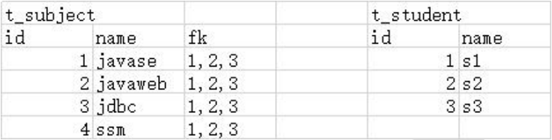

# 尚筹网 

## [01-尚硅谷-尚筹网-简介] 

### **1** **课程定位** 

从**单一架构**阶段到**分布式架构**阶段的过渡。后台管理员系统使用单一架构开发。前台会 

员系统使用分布式架构开发。 

---

### **2** **项目作用** 

帮助创业者**发布创业项目**，**向大众募集启动资金**的融资平台。

---

### **3** **业务功能**

---

### **4** **项目架构**

---


---

### **5** **前置要求** 

&bull; Spring 

&bull; SpringMVC 

&bull; MyBatis 

&bull; Maven 

---

### **6** **项目课程的学习方法** 

**6.1** **心态转变** 

养兵千日，用兵一时：着眼点要从学习具体技术的语法转变为思考如何实现业务功能需求。 

---

#### **6.2** **带兵出征** 

点：具体技术点 

线：每一个请求的处理过程是一条线，对应 Tomcat 的线程池中的一个线程 

面：多个请求组织在一起完成一个特定模块的功能 

体：多个模块组合在一起构成一个完整的项目 

---

#### **6.3** **攻城拔寨** 

目标：**聚焦**当前要完成的任务。目标明确后才能分析实现的思路。甚至有的时候需要对大目标进行拆解，把很多小目标各个击破。 

思路：针对目标的达成进行分析。具体到项目功能的实际开发中，体现为**流程图**。 

代码：参照思路分析时绘制的**流程图**，把步骤翻译成写代码时的**注释**，再对照注释具体编写**代码**

---

## [02-尚硅谷-尚筹网-项目背景] 

### **1** **商业背景** 

#### **1.1** **互联网金融**

##### **1.1.1** **简介** 

&bull; 互联网金融（ITFIN）是指传统金融机构与互联网企业利用互联网技术和信息通信技术实现资金融通、支付、投资和信息中介服务的新型金融业务模式。 

&bull; 互联网金融 ITFIN 不是互联网和金融业的简单结合，而是在实现安全、移动等网络技术水平上，被用户熟悉接受后（尤其是对电子商务的接受），自然而然为适应新的需求而产生的新模式及新业务。 

&bull; 传统金融行业与互联网技术相结合的新兴领域。 

---

##### **1.1.2** **应用** 

任何和金融相关的互联网应用都属于互联网金融。互联网金融通过互联网、移动互联网等工具，使得传统金融业务具备透明度更强、参与度更高、协作性更好、中间成本更低、操作上更便捷等一系列特征。


---

##### **1.1.3** **互联网金融发展的三个阶段**


---

##### **1.1.4** **业务模式**


---

##### **1.1.5** **互联网金融与软件开发**


---

#### **1.2** **众筹模式** 

##### **1.2.1** **模式** 

众筹系统，这个在网络上不断被搜索的热门词汇，从最初的陌生到熟悉，到现在不断被更新，出现各种不同的众筹模式，不得不承认众筹系统的出现，是对传统行业的一种冲击，对传统金融模式的一种冲击，同时对于年轻的一代而言，这也是一个契机、一个机遇、一个开创自己事业的平台，正是因为这些利好，让更多的人愿意去运用众筹系统，作为其项目发展孵化的平台。

---

##### **1.2.2** **案例** 

&bull; 美国总统竞选 

奥巴马竞选总统的时候，以 Facebook 为首的硅谷公司为奥巴马开通了网上的众筹渠道，让奥巴马短时间内就筹集到了比竞争对手高几倍的竞选资金。 

&bull; 乐视明星代言 

乐视开通体育频道请 C 罗代言，就通过众筹的方式筹集代言费。一方面是推广宣传，另外也是一种民意调查。 

&bull; 商学院招生 

中欧商学院招生时要求学费中的 60%必须来自周围亲友，以此来考验一个人在圈子中的支持度

---

### **2** **软件开发** 

#### **2.1** **瀑布模型** 

**把软件产品看成是一个工业化的标准品，以工厂生产产品的流水线思路来进行开发。**


---

#### **2.2** **敏捷开发** 

**敏捷开发是把一个软件产品看成是一个生物，每一个小功能的细微的迭代就好像是生物逐渐在进化一样。** 

##### **2.2.1** **技术角度** 

加速了根据需求开发出来可以运行的代码这个过程。 

需求→原型→编码 

原型：草图，众筹项目--尚筹网\参考资料\运城O2O原型-01.06\index.html

---

##### **2.2.2** **商业角度** 

加速了用户体验新功能的这个过程。“小步快跑”，让每一个功能都做尽量小的修改，但是加大更新的频率。

---

## [02-尚硅谷-尚筹网-环境搭建] 

### **1** **环境搭建总体目标**


---

### **2** **创建工程** 

#### **2.1** **项目架构图** 


---

#### **2.2** **工程创建计划** 

atcrowdfunding01-admin-parent 

​	groupId：com.atguigu.crowd 

​	artifactId：atcrowdfunding01-admin-parent 

​	packaging：pom 

atcrowdfunding02-admin-webui 

​	groupId：com.atguigu.crowd 

​	artifactId：atcrowdfunding02-admin-webui 

​	packaging：war 

atcrowdfunding03-admin-component 

​	groupId：com.atguigu.crowd 

​	artifactId：atcrowdfunding03-admin-component 

​	packaging：jar 

atcrowdfunding04-admin-entity 

​	groupId：com.atguigu.crowd

​	artifactId：atcrowdfunding04-admin-entity 

​	packaging：jar 

atcrowdfunding05-common-util 

​	groupId：com.atguigu.crowd 

​	artifactId：atcrowdfunding05-common-util 

​	packaging：jar 

atcrowdfunding06-common-reverse 

​	groupId：com.atguigu.crowd 

​	artifactId：atcrowdfunding06-common-reverse 

​	packaging：jar 

---

#### **2.3** **Maven工程和Maven模块**

创建工程时参与继承、聚合的工程以“Maven module”的方式创建，继承和聚合可以自动配置出来。具体做法是创建 parent 工程后，在 parent 工程上点右键，new→New Project→Empty Project→New Module

更改模块打包方式：在pom.xml里面\<packaging\>xxx\</packaging\>

---

#### **2.4** **建立工程之间的依赖关系** 

webui 依赖 component 

component 依赖 entity 

component 依赖 util

更改模块依赖关系：和导jar包一样,alt+insert或project structure

```xml
    <dependencies>
        <dependency>
            <groupId>com.lotushint</groupId>
            <artifactId>crowdfunding03-admin-component</artifactId>
            <version>1.0-SNAPSHOT</version>
        </dependency>
    </dependencies>
```

---

### **3** **创建数据库和数据库表** 

#### **3.1** **物理建模** 

##### **3.1.1** **理论** 

###### 第一范式：数据库表中的**每一列**都不可再分，也就是**原子性** 


这个表中“部门”和“岗位”应该拆分成两个字段：“部门名称”、“岗位”。


这样才能够专门针对“部门”或“岗位”进行查询。 


###### 第二范式：在满足第一范式基础上要求每个字段都和主键**完整**相关，而不是仅和主键部分相关（主要针对联合主键而言） 


“订单详情表”使用“订单编号”和“产品编号”作为联合主键。此时“产品价格”、“产品数量”都和联合主键整体相关，但“订单金额”和“下单时间”只和联合主键中的“订单编号”相关，和“产品编号”无关。所以只关联了主键中的部分字段，不满足第二范式。

把“订单金额”和“下单时间”移到订单表就符合第二范式了。


###### 第三范式：表中的非主键字段和主键字段**直接**相关，不允许间接相关 


上面表中的“部门名称”和“员工编号”的关系是“员工编号”→“部门编号”→“部门名称”，不是直接相关。此时会带来下列问题： 

&bull; 数据冗余：“部门名称”多次重复出现。 

&bull; 插入异常：组建一个新部门时没有员工信息，也就无法单独插入部门信息。就算强行插入部门信息，员工表中没有员工信息的记录同样是非法记录。 

&bull; 删除异常：删除员工信息会连带删除部门信息导致部门信息意外丢失。 

&bull; 更新异常：哪怕只修改一个部门的名称也要更新多条员工记录。 

正确的做法是：把上表拆分成两张表，以外键形式关联


“部门编号”和“员工编号”是直接相关的。 

第三范式的另一种表述方式是：两张表要通过外键关联，不保存冗余字段。例 

如：不能在“员工表”中存储“部门名称”。

---

##### **3.1.2** **实践** 

1.规则的变通 

​		三大范式是设计数据库表结构的规则约束，但是在实际开发中允许局部变通。

​		比如为了快速查询到关联数据可能会允许冗余字段的存在。例如在员工表中存储部门名称虽然违背第三范式，但是免去了对部门表的关联查询。 

2.根据业务功能设计数据库表 

​		&bull;看得见的字段

​			能够从需求文档或原型页面上直接看到的数据都需要设计对应的数据库表、字段来存储。


​			根据上面的原型页面我们看到管理员表需要包含如下字段： 

​				&diams; 账号 

​				&diams; 密码

​				&diams; 名称 

​				&diams; 邮箱地址

​		&bull;看不见的字段 

​			除了能够直接从需求文档中看到的字段，实际开发中往往还会包含一些其他字段来保存其他相关数据。例如：管理员表需要再增加如下字段以			有利于数据维护 

​				&diams;主键 

​				&diams;创建时间 

​		&bull;冗余字段 

​			为了避免建表时考虑不周有所遗漏，到后期再修改表结构非常麻烦，所以也有的团队会设置一些额外的冗余字段备用。 

​		&bull;实际开发对接 

​			实际开发中除了一些各个模块都需要使用的公共表在项目启动时创建好，其他专属于各个模块的表由该模块的负责人创建。但通常开发人员不能直接操作数据库服务器，所以需要把建表的 SQL 语句发送给运维工程师执行创建操作。

---

#### **3.2** **创建数据库** 

CREATE DATABASE `project_crowd` CHARACTER SET utf8;

---

#### **3.3** **创建管理员数据库表**

```mysql
use project_crowd;
drop table if exists t_admin;
create table t_admin
(
	id int not null auto_increment, # 主键
	login_acct varchar(255) not null, # 登录账号
    user_pswd char(32) not null, # 登录密码
    user_name varchar(255) not null, # 昵称
    email varchar(255) not null, # 邮件地址
    create_time char(19), # 创建时间
    primary key (id)
)
```

|  id  | login_acct | user_pswd | user_name |      email       | create_time |
| :--: | :--------: | :-------: | :-------: | :--------------: | :---------: |
|  1   | lotushint  |  123456   |  洛图辛   | lotushint@qq.com |   (Null)    |

---

### **4** **基于** **Maven** **的** **MyBatis** **逆向工程**

#### **4.1 pom** **配置**

```xml
<?xml version="1.0" encoding="UTF-8"?>
<project xmlns="http://maven.apache.org/POM/4.0.0"
         xmlns:xsi="http://www.w3.org/2001/XMLSchema-instance"
         xsi:schemaLocation="http://maven.apache.org/POM/4.0.0 http://maven.apache.org/xsd/maven-4.0.0.xsd">
    <modelVersion>4.0.0</modelVersion>

    <groupId>com.lotushint</groupId>
    <artifactId>crowdfunding06-common-reverse</artifactId>
    <version>1.0-SNAPSHOT</version>

    <properties>
        <maven.compiler.source>8</maven.compiler.source>
        <maven.compiler.target>8</maven.compiler.target>
    </properties>

    <!-- 依赖 MyBatis 核心包 -->
    <dependencies>
        <!-- https://mvnrepository.com/artifact/org.mybatis/mybatis -->
        <dependency>
            <groupId>org.mybatis</groupId>
            <artifactId>mybatis</artifactId>
            <version>3.5.7</version>
        </dependency>
    </dependencies>
    <!-- 控制 Maven 在构建过程中相关配置 -->
    <build>
        <!-- 构建过程中用到的插件 -->
        <plugins>
            <!-- 具体插件，逆向工程的操作是以构建过程中插件形式出现的 -->
            <plugin>
                <groupId>org.mybatis.generator</groupId>
                <artifactId>mybatis-generator-maven-plugin</artifactId>
                <version>1.3.0</version>

                <!-- 插件的依赖 -->
                <dependencies>
                    <!-- 逆向工程的核心依赖 -->
                    <dependency>
                        <groupId>org.mybatis.generator</groupId>
                        <artifactId>mybatis-generator-core</artifactId>
                        <version>1.3.7</version>
                    </dependency> <!-- 数据库连接池 -->
                    <!-- https://mvnrepository.com/artifact/com.alibaba/druid -->
                    <dependency>
                        <groupId>com.alibaba</groupId>
                        <artifactId>druid</artifactId>
                        <version>1.2.8</version>
                    </dependency>
                    <!-- MySQL 驱动 -->
                    <dependency>
                        <groupId>mysql</groupId>
                        <artifactId>mysql-connector-java</artifactId>
                        <version>8.0.27</version>
                    </dependency>
                </dependencies>
            </plugin>
        </plugins>
    </build>
</project>
```

---

#### **4.2 generatorConfig.xml**

```xml
<!DOCTYPE generatorConfiguration PUBLIC "-//mybatis.org//DTD MyBatis Generator Configuration 1.0//EN"
        "http://mybatis.org/dtd/mybatis-generator-config_1_0.dtd">
<generatorConfiguration> 
    <!-- mybatis-generator:generate -->
    <context id="lotushintTables" targetRuntime="MyBatis3">
        <commentGenerator> 
            <!-- 是否去除自动生成的注释 true:是;false:否 -->
            <property name="suppressAllComments" value="true"/>
        </commentGenerator> 
        <!--数据库连接的信息：驱动类、连接地址、用户名、密码 -->
        <jdbcConnection driverClass="com.mysql.cj.jdbc.Driver" 
                        connectionURL="jdbc:mysql://localhost:3306/project_crowd"
                        userId="root"
                        password="123456">
        </jdbcConnection> 
        <!-- 默认 false，把 JDBC DECIMAL 和 NUMERIC 类型解析为 Integer，
        为 true 时把 JDBC DECIMAL和 NUMERIC 类型解析为 java.math.BigDecimal -->
        <javaTypeResolver>
            <property name="forceBigDecimals" value="false"/>
        </javaTypeResolver> 
        <!-- targetProject:生成 Entity 类的路径 -->
        <javaModelGenerator targetProject=".\src\main\java"
                            targetPackage="com.lotushint.crowd.entity"> 
            <!-- enableSubPackages:是否让 schema 作为包的后缀 -->
            <property name="enableSubPackages" value="false"/> 
            <!-- 从数据库返回的值被清理前后的空格 -->
            <property name="trimStrings" value="true"/>
        </javaModelGenerator> 
        <!-- targetProject:XxxMapper.xml 映射文件生成的路径 -->
        <sqlMapGenerator targetProject=".\src\main\java"
                         targetPackage="com.lotushint.crowd.mapper"> 
            <!-- enableSubPackages:是否让 schema 作为包的后缀 -->
            <property name="enableSubPackages" value="false"/>
        </sqlMapGenerator> 
        <!-- targetPackage：Mapper 接口生成的位置 -->
        <javaClientGenerator type="XMLMAPPER" 
                             targetProject=".\src\main\java"
                             targetPackage="com.lotushint.crowd.mapper"> 
            <!-- enableSubPackages:是否让 schema 作为包的后缀 -->
            <property name="enableSubPackages" value="false"/>
        </javaClientGenerator> 
        <!-- 数据库表名字和我们的 entity 类对应的映射指定 -->
        <table tableName="t_admin" domainObjectName="Admin"/>
    </context>
</generatorConfiguration>
```

---

#### **4.3** **执行逆向生成操作的** **Maven** **命令** 


---

**4.4** **逆向工程生成的资源各归各位** 

WebUI 工程将来在 Tomcat 上运行时，现在 resources 目录下的资源会直接放在WEB-INF/classes 目录（也就是类路径）下，所以放在 resources 目录下运行的时候更容易找到。

```java
AtCrowdFunding/crowdfunding03-admin-component/src/main/java/com/lotushint/crowd/mapper/AdminMapper.java

AtCrowdFunding/crowdfunding02-admin-webui/src/main/resources/mybatis/mapper/AdminMapper.xml

AtCrowdFunding/crowdfunding04-admin-entity/src/main/java/com/lotushint/crowd/entity/Admin.java
AtCrowdFunding/crowdfunding04-admin-entity/src/main/java/com/lotushint/crowd/entity/AdminExample.java
```

将crowdfunding06-common-reverse模块下由mbg生成的文件移动到上述目录后，`AdminMapper.java`文件中@Param会**报错**，原因是缺少mybatis依赖，在AtCrowdFunding/crowdfunding03-admin-component/pom.xml中添加：

```xml
<!-- https://mvnrepository.com/artifact/org.mybatis/mybatis -->
<dependency>
	<groupId>org.mybatis</groupId>
	<artifactId>mybatis</artifactId>
    <version>3.5.7</version>
</dependency>
```

---

### **5** **父工程依赖管理** 

#### **5.1** **版本声明**

将来要改版本，一次修改，处处生效

```xml
<!--AtCrowdFunding/crowdfunding01-admin-parent/pom.xml-->

<properties>
    <!-- 声明属性，对 Spring 的版本进行统一管理 一次修改，处处生效-->
    <lotushint.spring.version>4.3.20.RELEASE</lotushint.spring.version> 
    <!-- 声明属性，对 SpringSecurity 的版本进行统一管理 -->
    <lotushint.spring.security.version>4.2.10.RELEASE</lotushint.spring.security.version>
</properties>
```

---

#### **5.2** **依赖管理** 

```xml
<!-- AtCrowdFunding/crowdfunding01-admin-parent/pom.xml -->

<?xml version="1.0" encoding="UTF-8"?>
<project xmlns="http://maven.apache.org/POM/4.0.0"
         xmlns:xsi="http://www.w3.org/2001/XMLSchema-instance"
         xsi:schemaLocation="http://maven.apache.org/POM/4.0.0 http://maven.apache.org/xsd/maven-4.0.0.xsd">
    <modelVersion>4.0.0</modelVersion>

    <groupId>com.lotushint</groupId>
    <artifactId>crowdfunding01-admin-parent</artifactId>
    <version>1.0-SNAPSHOT</version>
    <packaging>pom</packaging>
    
    <modules>
        <module>../crowdfunding02-admin-webui</module>
        <module>../crowdfunding03-admin-component</module>
        <module>../crowdfunding04-admin-entity</module>
    </modules>

    <properties>
        <!-- 声明属性，对 Spring 的版本进行统一管理 一次修改，处处生效-->
        <lotushint.spring.version>4.3.20.RELEASE</lotushint.spring.version> <!-- 声明属性，对 SpringSecurity 的版本进行统一管理 -->
        <lotushint.spring.security.version>4.2.10.RELEASE</lotushint.spring.security.version>
    </properties>

    <dependencyManagement>
        <dependencies>
            <!-- Spring 依赖 -->
            <!-- https://mvnrepository.com/artifact/org.springframework/spring-orm -->
            <dependency>
                <groupId>org.springframework</groupId>
                <artifactId>spring-orm</artifactId>
                <version>${lotushint.spring.version}</version>
            </dependency>
            <!-- https://mvnrepository.com/artifact/org.springframework/spring-webmvc -->
            <dependency>
                <groupId>org.springframework</groupId>
                <artifactId>spring-webmvc</artifactId>
                <version>${lotushint.spring.version}</version>
            </dependency>
            <dependency>
                <groupId>org.springframework</groupId>
                <artifactId>spring-test</artifactId>
                <version>${lotushint.spring.version}</version>
            </dependency>
            <!-- https://mvnrepository.com/artifact/org.aspectj/aspectjweaver -->
            <dependency>
                <groupId>org.aspectj</groupId>
                <artifactId>aspectjweaver</artifactId>
                <version>1.9.2</version>
            </dependency>
            <!-- https://mvnrepository.com/artifact/cglib/cglib -->
            <dependency>
                <groupId>cglib</groupId>
                <artifactId>cglib</artifactId>
                <version>2.2</version>
            </dependency>
            <!-- 数据库依赖 -->
            <!-- MySQL 驱动 -->
            <dependency>
                <groupId>mysql</groupId>
                <artifactId>mysql-connector-java</artifactId>
                <version>8.0.27</version>
            </dependency>
            <!-- 数据源 -->
            <dependency>
                <groupId>com.alibaba</groupId>
                <artifactId>druid</artifactId>
                <version>1.0.31</version>
            </dependency>
            <!-- MyBatis -->
            <dependency>
                <groupId>org.mybatis</groupId>
                <artifactId>mybatis</artifactId>
                <version>3.2.8</version>
            </dependency> <!-- MyBatis 与 Spring 整合 -->
            <dependency>
                <groupId>org.mybatis</groupId>
                <artifactId>mybatis-spring</artifactId>
                <version>1.2.2</version>
            </dependency>
            <!-- MyBatis 分页插件 -->
            <dependency>
                <groupId>com.github.pagehelper</groupId>
                <artifactId>pagehelper</artifactId>
                <version>4.0.0</version>
            </dependency>
            <!-- 日志 -->
            <dependency>
                <groupId>org.slf4j</groupId>
                <artifactId>slf4j-api</artifactId>
                <version>1.7.7</version>
            </dependency>
            <dependency>
                <groupId>ch.qos.logback</groupId>
                <artifactId>logback-classic</artifactId>
                <version>1.2.3</version>
            </dependency>
            <!-- 其他日志框架的中间转换包 -->
            <dependency>
                <groupId>org.slf4j</groupId>
                <artifactId>jcl-over-slf4j</artifactId>
                <version>1.7.25</version>
            </dependency>
            <dependency>
                <groupId>org.slf4j</groupId>
                <artifactId>jul-to-slf4j</artifactId>
                <version>1.7.25</version>
            </dependency>
            <!-- Spring 进行 JSON 数据转换依赖 -->
            <dependency>
                <groupId>com.fasterxml.jackson.core</groupId>
                <artifactId>jackson-core</artifactId>
                <version>2.9.8</version>
            </dependency>
            <dependency>
                <groupId>com.fasterxml.jackson.core</groupId>
                <artifactId>jackson-databind</artifactId>
                <version>2.9.8</version>
            </dependency>
            <!-- JSTL 标签库 -->
            <dependency>
                <groupId>jstl</groupId>
                <artifactId>jstl</artifactId>
                <version>1.2</version>
            </dependency>
            <!-- junit 测试 -->
            <dependency>
                <groupId>junit</groupId>
                <artifactId>junit</artifactId>
                <version>4.12</version>
                <scope>test</scope>
            </dependency>
            <!-- 引入 Servlet 容器中相关依赖 -->
            <dependency>
                <groupId>javax.servlet</groupId>
                <artifactId>servlet-api</artifactId>
                <version>2.5</version>
                <scope>provided</scope>
            </dependency>
            <!-- JSP 页面使用的依赖 -->
            <dependency>
                <groupId>javax.servlet.jsp</groupId>
                <artifactId>jsp-api</artifactId>
                <version>2.1.3-b06</version>
                <scope>provided</scope>
            </dependency>
            <!-- https://mvnrepository.com/artifact/com.google.code.gson/gson -->
            <dependency>
                <groupId>com.google.code.gson</groupId>
                <artifactId>gson</artifactId>
                <version>2.8.5</version>
            </dependency>
            <!-- SpringSecurity 对 Web 应用进行权限管理 -->
            <dependency>
                <groupId>org.springframework.security</groupId>
                <artifactId>spring-security-web</artifactId>
                <version>4.2.10.RELEASE</version>
            </dependency>
            <!-- SpringSecurity 配置 -->
            <dependency>
                <groupId>org.springframework.security</groupId>
                <artifactId>spring-security-config</artifactId>
                <version>4.2.10.RELEASE</version>
            </dependency>
            <!-- SpringSecurity 标签库 -->
            <dependency>
                <groupId>org.springframework.security</groupId>
                <artifactId>spring-security-taglibs</artifactId>
                <version>4.2.10.RELEASE</version>
            </dependency>
        </dependencies>
    </dependencyManagement>
</project>
```

---

**5.3** **依赖信息来源** 

&bull;到专门网站搜索 

​	https://mvnrepository.com 

&bull;调试

​	根据实际运行情况，确认 jar 包之间是否兼容SpringMVC 需要 jackson 的支持，来处理 JSON 数据。但是 SpringMVC 并没有依赖 jackson。所以需要我们自己保证 jar 包之间的兼容性。 

---

### **6 Spring** **整合** **MyBatis** 

#### **6.1** **目标** 

adminMapper 通过 IOC 容器装配到当前组件中后，就可以直接调用它的方法，享受到框架给我们提供的方便**（体会其中用意，而不是它该怎么写你就怎么写，这么是为了体会到框架给我们带来的便利）**

###### 到了此处，想一想，怎么将Spring和MyBatis整合到一起？


---

#### **6.2** **思路** 


---

#### **6.3** **操作清单** 

在子工程中加入搭建环境所需要的具体依赖 (父类中配置的是Dependency Management，只是管理依赖的版本，并不会导入依赖，子项目用的还要另外导入，而Depenencies是全部导入)

准备 jdbc.properties 

创建 Spring 配置文件专门配置 Spring 和 MyBatis 整合相关 

在 Spring 的配置文件中加载 jdbc.properties 属性文件 

配置数据源 

测试从数据源中获取数据库连接 

配置 SqlSessionFactoryBean 

​		装配数据源 

​		指定 XxxMapper.xml 配置文件的位置 

​		指定 MyBatis 全局配置文件的位置（可选） 

配置 MapperScannerConfigurer 

测试是否可以装配 XxxMapper 接口并通过这个接口操作数据库

---

#### **6.4** **操作步骤详解** 

##### **6.4.1** **在子工程中加入搭建环境所需的具体依赖**


最好将有关的东西放在一起，这也是`高内聚，低耦合`理念的一种体现。

子工程：选择 component 工程。原因是具体依赖和 component 工程相关。


```xml
<!-- Spring 依赖 -->
<!-- https://mvnrepository.com/artifact/org.springframework/spring-orm -->
<dependency>
    <groupId>org.springframework</groupId>
    <artifactId>spring-orm</artifactId>
</dependency>
<!-- https://mvnrepository.com/artifact/org.springframework/spring-webmvc -->
<dependency>
    <groupId>org.springframework</groupId>
    <artifactId>spring-webmvc</artifactId>
</dependency>
<!-- https://mvnrepository.com/artifact/org.aspectj/aspectjweaver -->
<dependency>
    <groupId>org.aspectj</groupId>
    <artifactId>aspectjweaver</artifactId>
</dependency>
<!-- https://mvnrepository.com/artifact/cglib/cglib -->
<dependency>
    <groupId>cglib</groupId>
    <artifactId>cglib</artifactId>
</dependency>
<!-- MySQL 驱动 -->
<dependency>
    <groupId>mysql</groupId>
    <artifactId>mysql-connector-java</artifactId>
</dependency>
<!-- 数据源 -->
<dependency>
    <groupId>com.alibaba</groupId>
    <artifactId>druid</artifactId>
</dependency>
<!-- MyBatis -->
<dependency>
    <groupId>org.mybatis</groupId>
    <artifactId>mybatis</artifactId>
</dependency>
<!-- MyBatis 与 Spring 整合 -->
<dependency>
    <groupId>org.mybatis</groupId>
    <artifactId>mybatis-spring</artifactId>
</dependency>
<!-- MyBatis 分页插件 -->
<dependency>
    <groupId>com.github.pagehelper</groupId>
    <artifactId>pagehelper</artifactId>
</dependency>
<!-- Spring 进行 JSON 数据转换依赖 -->
<dependency>
    <groupId>com.fasterxml.jackson.core</groupId>
    <artifactId>jackson-core</artifactId>
</dependency>
<dependency>
    <groupId>com.fasterxml.jackson.core</groupId>
    <artifactId>jackson-databind</artifactId>
</dependency>
<!-- JSTL 标签库 -->
<dependency>
    <groupId>jstl</groupId>
    <artifactId>jstl</artifactId>
</dependency>
<!-- https://mvnrepository.com/artifact/com.google.code.gson/gson -->
<dependency>
    <groupId>com.google.code.gson</groupId>
    <artifactId>gson</artifactId>
</dependency>
```

---

##### **6.4.2** **数据库连接信息** 

jdbc.properties


```properties
jdbc.url=jdbc:mysql://localhost:3306/project_crowd?useUnicode=true&characterEncoding=UTF-8
jdbc.driver=com.mysql.cj.jdbc.Driver
jdbc.username=root
jdbc.password=123456
```

---

##### **6.4.3 mybatis-config.xml**


```xml
<?xml version="1.0" encoding="UTF-8"?> <!DOCTYPE configuration PUBLIC "-//mybatis.org//DTD Config 3.0//EN"
        "http://mybatis.org/dtd/mybatis-3-config.dtd">
<configuration>
    
</configuration>
```

---

##### **6.4.4** **创建** **spring-persist-mybatis.xml** 


```xml
<?xml version="1.0" encoding="UTF-8"?> <!DOCTYPE configuration PUBLIC "-//mybatis.org//DTD Config 3.0//EN"
        "http://mybatis.org/dtd/mybatis-3-config.dtd">
<configuration>

</configuration>
```

---

##### **6.4.5 Spring** **具体配置：第一步 配置数据源**

```xml
在 spring-persist-mybatis.xml 配置文件进行配置 
<!-- 加载 jdbc.properties -->
<context:property-placeholder location="classpath:jdbc.properties"/>
<!-- 配置数据源 -->
<bean id="dataSource" class="com.alibaba.druid.pool.DruidDataSource">
    <property name="username" value="${jdbc.username}"/>
    <property name="password" value="${jdbc.password}"/>
    <property name="url" value="${jdbc.url}"/>
    <property name="driverClassName" value="${jdbc.driver}"/>
</bean>
```

```java
//创建 Spring 的 Junit 测试类 
// 指定 Spring 给 Junit 提供的运行器类 
@RunWith(SpringJUnit4ClassRunner.class) 
// 加载 Spring 配置文件的注解
@ContextConfiguration(locations = {"classpath:spring-persist-mybatis.xml"}) 
public class CrowdSpringTest { 
    @Autowired 
    private DataSource dataSource; 
    @Test 
    public void testDataSource() throws SQLException { 
        // 1.通过数据源对象获取数据源连接 
        Connection connection = dataSource.getConnection(); 
        // 2.打印数据库连接 System.out.println(connection); 
    } 
}
```

<font color="#dd0000">注意：为了能够在webui中执行Junit,需要把spring-test和junit依赖转移到webui中</font>

```xml
<!-- 在 component 的 pom.xml 中添加了下面 junit 和 spring-test 依赖，但是不能传递所以在这再次添加依赖 -->
<!-- junit测试 -->
<dependency>
    <groupId>junit</groupId>
    <artifactId>junit</artifactId>
    <scope>test</scope>
</dependency>
<dependency>
    <groupId>org.springframework</groupId>
    <artifactId>spring-test</artifactId>
    <scope>test</scope>
</dependency>
```

---

##### **6.4.6 Spring** **具体配置：第二步 配置** **SqlSessionFactoryBean** 

```xml
<!-- AtCrowdFunding/crowdfunding02-admin-webui/src/main/resources/spring-persist-mybatis.xml -->

<!-- 配置SqlSessionFactoryBean整合MyBatis -->
<bean id="sqlSessionFactoryBean" class="org.mybatis.spring.SqlSessionFactoryBean">
    <!-- 指定MyBatis全局配置文件位置 -->
    <property name="configLocation" value="classpath:mybatis-config.xml"/>
    <!-- 指定Mapper.xml配置文件位置, 不要写死成AdminMapper.xml，要写成*Mapper.xml-->
    <property name="mapperLocations" value="classpath:mybatis/mapper/*Mapper.xml"/>
    <!-- 装配数据源 -->
    <property name="dataSource" ref="dataSource"/>
</bean>
```

---

##### **6.4.7 Spring** **具体配置：第三步 配置** **MapperScannerConfigurer**

```xml
<!-- AtCrowdFunding/crowdfunding02-admin-webui/src/main/resources/spring-persist-mybatis.xml -->

<!-- 配置MapperScannerConfigurer来扫描Mapper接口所在的包 -->
<bean id="mapperScannerConfigurer" class="org.mybatis.spring.mapper.MapperScannerConfigurer">
    <property name="basePackage" value="com.lotushint.crowd.mapper"/>
</bean>
```

---

##### **6.5** **小结**


---

### **7** **日志系统** 

#### **7.1** **重要意义** 

**系统在运行过程中出了问题就需要通过日志来进行排查，所以我们在上手任何新技术的时候，都要习惯性的关注一下它是如何打印日志的。**


---

#### **7.2** **技术选型** 

##### **7.2.1** **总体介绍**

<font size="5" color="blue">**门面(接口)：**</font>

|                             名称                             |                             说明                             |
| :----------------------------------------------------------: | :----------------------------------------------------------: |
|                 JCL(Jakarta Commons Logging)                 |                             陈旧                             |
| <font color="red">SLF4J(Simple Logging Facade for Java)</font> | 适合（**同一作者，指的是和下面的log4j和logback是同一作者**） |
|                        jboss-logging                         |                       特殊专业领域使用                       |

<font size="5" color="blue">**实现：**</font>

|                         名称                          |                          说明                           |
| :---------------------------------------------------: | :-----------------------------------------------------: |
|            <font color="red">log4j</font>             |                 最初版（**同一作者**）                  |
|                          JUL                          |                   JDK 自带（不考虑）                    |
|                        log4j2                         | Apache 收购 log4j 后全面重构，内部实现和 log4j 完全不同 |
| <font color="red">logback</font>（是SLF4J的天然实现） |               优雅、强大（**同一作者**）                |

---

##### **7.2.2** **不同日志系统的整合**


---

#### **7.3** **具体操作** 

##### **7.3.1** **初始状态** 

Spring 使用 commons-logging 日志包。打印的日志是下面这样的。不用细看，截图放在这是为了和后面日志打印的情况对比。


---

---

##### **7.3.2** **加入** **slf4j+logback**

添加jar：

```xml
<!-- 日志 -->
<dependency>
    <groupId>org.slf4j</groupId>
    <artifactId>slf4j-api</artifactId>
</dependency>
<dependency>
    <groupId>ch.qos.logback</groupId>
    <artifactId>logback-classic</artifactId>
</dependency>
```


logback有5种级别，分别是TRACE < DEBUG < INFO < WARN < ERROR，定义于ch.qos.logback.classic.Level类中。

> 日志级别

&bull; Trace:是追踪，就是程序推进以下，你就可以写个trace输出，所以trace应该会特别多，不过没关系，我们可以设置最低日志级别不让他输出.

&bull; Debug:指出细粒度信息事件对调试应用程序是非常有帮助的.

&bull; Info:消息在粗粒度级别上突出强调应用程序的运行过程.

&bull; Warn:输出警告及warn以下级别的日志.

&bull; Error:输出错误信息日志.

此外OFF表示关闭全部日志，ALL表示开启全部日志。

**日志输出的时候，级别大的会输出，根据当前ROOT 级别，日志输出时，级别高于root默认的级别时会输出，比如如果root的级别是info，那么会输出info以及info级别以上的日志。**


---

##### **7.3.3 ** **更换框架的日志系统**

&diams; 第一步：排除 commons-logging（Spring5好像去除这个日志）

加`<exclusions>`标签，也可在图形化界面exclude

```xml
<!-- AtCrowdFunding/crowdfunding03-admin-component/pom.xml -->

<!-- Spring 依赖 -->
<!-- https://mvnrepository.com/artifact/org.springframework/spring-orm -->
<dependency>
    <groupId>org.springframework</groupId>
    <artifactId>spring-orm</artifactId>
    
    <exclusions>
        <exclusion>
            <artifactId>commons-logging</artifactId>
            <groupId>commons-logging</groupId>
        </exclusion>
    </exclusions>
    
</dependency>
```

&diams; 第二步：加入转换包


---

##### **7.3.4** **logback配置文件**

logback 工作时的具体细节可以通过 logback.xml 来配置。

```xml
<!-- AtCrowdFunding/crowdfunding02-admin-webui/src/main/resources/logback.xml -->

<?xml version="1.0" encoding="utf-8" ?>
<configuration debug="true">
    <!-- 指定日志输出的位置 appender追加器，不断打印日志-->
    <appender name="STDOUT" class="ch.qos.logback.core.ConsoleAppender">
        <encoder>
            <!-- 日志输出的格式 -->
            <!-- "[","]" 没有特殊含义，打印时整齐-->
            <!-- 按照顺序分别是：时间、日志级别、线程名称、打印日志的类、日志主体 内容、换行 -->
            <pattern>[%d{HH:mm:ss.SSS}] [%-5level] [%thread] [%logger] [%msg]%n</pattern>
        </encoder>
    </appender>
    <!-- 设置全局日志级别。日志级别按顺序分别是：DEBUG、INFO、WARN、ERROR -->
    <!-- 指定任何一个日志级别都只打印当前级别和后面级别的日志。 -->
    <root level="INFO">
        <!-- 指定打印日志的 appender，这里通过“STDOUT”引用了前面配置的 appender -->
        <appender-ref ref="STDOUT"/>
    </root>
    <!-- 根据特殊需求指定局部日志级别 -->
    <logger name="com.lotushint.crowd.mapper" level="DEBUG"/>
</configuration>
```


开发阶段确定没bug了，项目要上线了，把局部日志级别改为INFO:


---

### **8** **声明式事务** 

#### **8.1** **目标** 

从事务角度：一个事务方法中包含的多个数据库操作，要么一起提交、要么一起回滚。也就是说事务方法中的多个数据库操作，有任何一个失败，整个事务全部回滚。 

从声明式角度：由 Spring 来全面接管数据库事务。用声明式代替编程式。

```java
try { 
    // 核心操作前：开启事务（关闭自动提交） 
    // 对应 AOP 的前置通知             
    connection.setAutoCommit(false);    //呱呱坠地
    // 核心操作 
    adminService.updateXxx(xxx, xxx); 
    // 核心操作成功：提交事务 
    // 对应 AOP 的返回通知 
    connection.commit();                //寿终正寝
}catch(Exception e){ 
    // 核心操作失败：回滚事务 
    // 对应 AOP 的异常通知 
    connection.rollBack();              //意外身亡
}finally{ 
    // 不论成功还是失败，核心操作终归是结束了 
    // 核心操作不管是怎么结束的，都需要释放数据库连接 
    // 对应 AOP 的后置通知 
    if(connection != null){ 
        connection.close();             //准备后事
    } 
}
```

---

#### **8.2** **思路** 


---

####  **8.3** **操作** 

##### **8.3.1** **加入** **AOP** **依赖包**

```xml
<!-- AtCrowdFunding/crowdfunding03-admin-component/pom.xml -->

<!-- AOP 所需依赖 -->
<!-- https://mvnrepository.com/artifact/org.aspectj/aspectjweaver -->
<dependency>
	<groupId>org.aspectj</groupId>
	<artifactId>aspectjweaver</artifactId>
</dependency>
<!-- AOP 所需依赖 -->
<!-- https://mvnrepository.com/artifact/cglib/cglib -->
<dependency>
	<groupId>cglib</groupId>
	<artifactId>cglib</artifactId>
</dependency>
```

---

##### **8.3.2** **第一步：创建** **Spring** **配置文件**

这里可以不新建一个配置文件，可以在`AtCrowdFunding/crowdfunding02-admin-webui/src/main/resources/spring-persist-mybatis.xml`中直接配置，但是为了保证开发的配置文件不要太长，所以新建一个配置文件`AtCrowdFunding/crowdfunding02-admin-webui/src/main/resources/spring-persist-tx.xml`（和**单一职责原则**有异曲同工之妙）。

创建包和类：


```xml
<!-- AtCrowdFunding/crowdfunding02-admin-webui/src/main/resources/spring-persist-tx.xml -->

<?xml version="1.0" encoding="UTF-8"?>
<beans xmlns="http://www.springframework.org/schema/beans"
       xmlns:xsi="http://www.w3.org/2001/XMLSchema-instance"
       xmlns:context="http://www.springframework.org/schema/context"
       xsi:schemaLocation="http://www.springframework.org/schema/beans http://www.springframework.org/schema/beans/spring-beans.xsd http://www.springframework.org/schema/context https://www.springframework.org/schema/context/spring-context.xsd">

    <context:component-scan base-package="com.lotushint.crowd.service"></context:component-scan>
    
</beans>
```

---

##### **8.3.3** **第二步：配置事务管理器** 

```xml
<!-- AtCrowdFunding/crowdfunding02-admin-webui/src/main/resources/spring-persist-tx.xml -->

<!-- 配置事务管理器 -->
<bean id="txManager" class="org.springframework.jdbc.datasource.DataSourceTransactionManager">
    <!-- 装配数据源  ref属性爆红没关系，datasource在另一个配置文件spring-persist-mybatis.xml里,运行时会自动从IOC容器里找到-->
    <property name="dataSource" ref="dataSource"/>
</bean>
```

如果我们配置了两个spring文件，那么`ref="dataSource"`属性会爆红，想要消除爆红，此时可以在Project Structure-->Modules里配置Spring Application Context:


---

##### **8.3.4** **第三步：配置** **AOP**

**切入点表达式怎么写（灵活记忆）：**


```xml
<!-- AtCrowdFunding/crowdfunding02-admin-webui/src/main/resources/spring-persist-tx.xml -->

<!-- 配置事务切面 -->
<aop:config>
	<aop:pointcut id="" expression="execution(* *..*Service.*(..))"/>
</aop:config>
```

考虑到后面要用`SpringSecurity`,其中有一个类叫`UserDetailsService`,它也符合上面的切入点表达式，它和声明式事务没什么关系，如果把它也扫描到声明式事务中会抛异常，所以要改一下：

```xml
<!-- AtCrowdFunding/crowdfunding02-admin-webui/src/main/resources/spring-persist-tx.xml -->

<!-- 配置事务切面 -->
<aop:config>
    <!-- 考虑到后面我们整合SpringSecurity,避免把UserDetailsService加入事务控制，让切入点表达式定位到ServiceImpl -->
    <aop:pointcut id="" expression="execution(* *..*ServiceImpl.*(..))"/>
    
    <!-- 将事务通知和切入点表达式关联到一起 -->
    <aop:advisor advice-ref="txAdvice" pointcut-ref="txPointCut"></aop:advisor>
</aop:config>
```

---

##### **8.3.5** **第四步：配置事务属性**

```xml
<!-- AtCrowdFunding/crowdfunding02-admin-webui/src/main/resources/spring-persist-tx.xml -->

<!-- 配置事务通知 -->
<!-- id 属性用于在 aop:advisor 中引用事务通知 -->
<!-- transaction-manager 属性用于引用事务管理器，如果事务管理器的 bean 的 id 正好是 transactionManager，可以省略这个属性 -->
<tx:advice id="txAdvice" transaction-manager="txManager">
	<!-- 配置事务属性 -->
    <tx:attributes>
    	<!-- name 属性指定当前要配置的事务方法的方法名 -->
        <!-- 查询的方法通常设置为只读，便于数据库根据只读属性进行相关性能优化 -->
        <tx:method name="get*" read-only="true"/>
        <tx:method name="query*" read-only="true"/>
        <tx:method name="find*" read-only="true"/>
        <tx:method name="count*" read-only="true"/>

        <!-- 涉及增删改查操作的方法的配置 -->
        <!-- propagation属性配置事务方法的传播行为 -->
        <!--
        	默认行为：REQUIRED，表示当前方法必须运行在事务中，如果没有事务，则开启事务，在自己的事务中运行。
            	如果已经有了已开启的事务，则在当前事务中运行。有可能和其他方法共用同一个事务
                	顾虑：用别人的事务有可能“被”回滚
            建议设置：REQUIRES_NEW，表示当前方法必须运行在事务中，如果没有事务，则开启事务，在自己的事务中运行。
            	和 REQUIRED 的区别是就算现在已经有了已开启的事务，也一定要开启自己的事务，避免和其他方法共用同一个事务。
                    好处：不会受到其他事务回滚的影响
        -->
        <!--
        	rollback-for：表示触发什么异常时，进行回滚；
            	默认值：运行时异常，
                建议设置为运行时异常+编译期异常
        -->
        <tx:method name="save*" propagation="REQUIRES_NEW" rollback-for="java.lang.Exception"/>
        <tx:method name="update*" propagation="REQUIRES_NEW" rollback-for="java.lang.Exception"/>
        <tx:method name="remove*" propagation="REQUIRES_NEW" rollback-for="java.lang.Exception"/>

	</tx:attributes>
</tx:advice>
```

元素 `tx:advice` 没有出现属性 `transaction-manager`

**IDEA自动生成的spring配置文件引用的xmlns不对，使用这个即可解决问题**

```xml
xmlns:tx="http://www.springframework.org/schema/tx"
```


---

##### **最终spring-persist-tx.xml文件:**

```xml
<?xml version="1.0" encoding="UTF-8"?>
<beans xmlns="http://www.springframework.org/schema/beans"
       xmlns:xsi="http://www.w3.org/2001/XMLSchema-instance"
       xmlns:context="http://www.springframework.org/schema/context"
       xmlns:tx="http://www.springframework.org/schema/tx"
       xmlns:aop="http://www.springframework.org/schema/aop"
       xsi:schemaLocation="http://www.springframework.org/schema/beans http://www.springframework.org/schema/beans/spring-beans.xsd
        http://www.springframework.org/schema/context http://www.springframework.org/schema/context/spring-context-4.3.xsd
        http://www.springframework.org/schema/aop http://www.springframework.org/schema/aop/spring-aop-4.3.xsd
        http://www.springframework.org/schema/tx http://www.springframework.org/schema/tx/spring-tx-4.3.xsd">

    <context:component-scan base-package="com.lotushint.crowd.service"></context:component-scan>

    <!-- 配置事务管理器 -->
    <bean id="txManager" class="org.springframework.jdbc.datasource.DataSourceTransactionManager">
        <!-- 装配数据源  ref属性爆红没关系，datasource在另一个配置文件spring-persist-mybatis.xml里,运行时会自动从IOC容器里找到-->
        <property name="dataSource" ref="dataSource"/>
    </bean>

    <!-- 配置事务切面 -->
    <aop:config>
        <!-- 考虑到后面我们整合SpringSecurity,避免把UserDetailsService加入事务控制，让切入点表达式定位到ServiceImpl -->
        <aop:pointcut id="txPointCut" expression="execution(* *..*ServiceImpl.*(..))"/>

        <!-- 将事务通知和切入点表达式关联到一起 -->
        <aop:advisor advice-ref="txAdvice" pointcut-ref="txPointCut"/>
    </aop:config>

    <!-- 配置事务通知 -->
    <!-- id 属性用于在 aop:advisor 中引用事务通知 -->
    <!-- transaction-manager 属性用于引用事务管理器，如果事务管理器的 bean 的 id 正好是 transactionManager，可以省略这个属性 -->
    <tx:advice id="txAdvice" transaction-manager="txManager">
        <!-- 配置事务属性 -->
        <tx:attributes>
            <!-- name 属性指定当前要配置的事务方法的方法名 -->
            <!-- 查询的方法通常设置为只读，便于数据库根据只读属性进行相关性能优化 -->
            <tx:method name="get*" read-only="true"/>
            <tx:method name="query*" read-only="true"/>
            <tx:method name="find*" read-only="true"/>
            <tx:method name="count*" read-only="true"/>

            <!-- 涉及增删改查操作的方法的配置 -->
            <!-- propagation属性配置事务方法的传播行为 -->
            <!--
                默认行为：REQUIRED，表示当前方法必须运行在事务中，如果没有事务，则开启事务，在自己的事务中运行。
                    如果已经有了已开启的事务，则在当前事务中运行。有可能和其他方法共用同一个事务
                        顾虑：用别人的事务有可能“被”回滚
                建议设置：REQUIRES_NEW，表示当前方法必须运行在事务中，如果没有事务，则开启事务，在自己的事务中运行。
                    和 REQUIRED 的区别是就算现在已经有了已开启的事务，也一定要开启自己的事务，避免和其他方法共用同一个事务。
                        好处：不会受到其他事务回滚的影响
            -->
            <!--
                rollback-for：表示触发什么异常时，进行回滚；
                    默认值：运行时异常，
                    建议设置为运行时异常+编译期异常
            -->
            <tx:method name="save*" propagation="REQUIRES_NEW" rollback-for="java.lang.Exception"/>
            <tx:method name="update*" propagation="REQUIRES_NEW" rollback-for="java.lang.Exception"/>
            <tx:method name="remove*" propagation="REQUIRES_NEW" rollback-for="java.lang.Exception"/>

        </tx:attributes>
    </tx:advice>
</beans>
```


---

#### **8.4** **测试**

##### **8.4.1** **创建类和编写代码**


代码：

```java
//AtCrowdFunding/crowdfunding03-admin-component/src/main/java/com/lotushint/crowd/service/api/AdminService.java

package com.lotushint.crowd.service.api;

import com.lotushint.crowd.entity.Admin;

import java.util.List;

/**
 * @author lotushint
 * @version 1.0
 * @date 2022 2022/5/11 17:32
 * @package com.lotushint.crowd.service.api
 * @description
 */
public interface AdminService {
    void saveAdmin(Admin admin);

    List<Admin> getAll();
}

```


```java
//AtCrowdFunding/crowdfunding03-admin-component/src/main/java/com/lotushint/crowd/service/impl/AdminServiceImpl.java

package com.lotushint.crowd.service.impl;

import com.lotushint.crowd.entity.Admin;
import com.lotushint.crowd.entity.AdminExample;
import com.lotushint.crowd.mapper.AdminMapper;
import com.lotushint.crowd.service.api.AdminService;
import org.springframework.beans.factory.annotation.Autowired;
import org.springframework.stereotype.Service;

import java.util.List;

/**
 * @author lotushint
 * @version 1.0
 * @date 2022 2022/5/11 17:32
 * @package com.lotushint.crowd.service.impl
 * @description
 */
@Service
public class AdminServiceImpl implements AdminService {
    @Autowired
    private AdminMapper adminMapper;

    @Override
    public void saveAdmin(Admin admin) {
        adminMapper.insert(admin);
    }

    @Override
    public List<Admin> getAll() {
        return adminMapper.selectByExample(new AdminExample());
    }

}

```

#####  **8.4.2** **注意添加新创建的配置文件**

别忘了添加spring配置文件，不然

```java
@Autowired
private AdminService adminService;
```

不能自动注入


##### **8.4.3** **测试异常回滚**

```java
//AtCrowdFunding/crowdfunding03-admin-component/src/main/java/com/lotushint/crowd/service/impl/AdminServiceImpl.java
//在saveAdmin方法中添加如下：

//测试回滚
throw new RuntimeException();
```


##### **8.4.4** **注意事务属性**

在基于XML的声明式事务中，事务属性的`tx:method`是必须配置的，如果某个方法没有配置对应的`tx:method`，那么事务对这个方法就不生效！

---

### **9** **表述层工作机制**

#### **9.1** **目标**

目标1：handler中装配Service

目标2：页面能够访问到handler


页面->handler(@RequestMapping) ->Service->Mapper->数据库

---

#### **9.2** **web.xml与Spring配置文件的关系（思路）**


---

#### **9.3**  **访问过程**


### **10** **表述层环境搭建**

#### **10.1** **加入依赖** 

使用 SpringMVC 环境引入 spring-webmvc 依赖即可，同时可以把 spring-context 依赖去掉，因为根据依赖的传递性，spring-webmvc 会依赖 spring-context。

---

#### **10.2** **web.xml配置**

**10.2.1 ContextLoaderListener** 

作用：加载 Spring 的配置文件，根据 Spring 的配置文件初始化 IOC 容器。

```xml
<!-- AtCrowdFunding/crowdfunding02-admin-webui/src/main/webapp/WEB-INF/web.xml -->

<!-- 配置 ContextLoaderListener 加载 Spring 配置文件 -->
<!-- needed for ContextLoaderListener -->
<context-param>
    <param-name>contextConfigLocation</param-name>
    <param-value>classpath:spring-persist-*.xml</param-value>
</context-param>
<!-- Bootstraps the root web application context before servlet initialization -->
<listener>
    <listener-class>org.springframework.web.context.ContextLoaderListener</listener-class>
</listener>
```

**10.2.2 CharacterEncodingFilter** 

解决 POST 请求的字符乱码问题。需要注意的是：在 web.xml 中存在多个 Filter 时，让这个 Filter 作为过滤器链中的第一个 Filter。 

​	request.setCharacterEncoding(encoding) 要求必须在所有request.getParameter(xxx)操作前面

​	response.setCharacterEncoding(encoding)要求必须在所有 response.getWriter() 操作前面

不满足这个顺序要求字符集设定无法生效

```xml
 <!-- 配置 CharacterEncodingFilter 解决 POST 请求的字符乱码问题 -->
<filter>
    <filter-name>CharacterEncodingFilter</filter-name>
    <filter-class>org.springframework.web.filter.CharacterEncodingFilter</filter-class>
    <!-- 指定字符集 -->
    <init-param>
        <param-name>encoding</param-name>
        <param-value>UTF-8</param-value>
    </init-param>
    <!-- 强制请求进行编码 -->
    <init-param>
        <param-name>forceRequestEncoding</param-name>
        <param-value>true</param-value>
    </init-param>
    <!-- 强制响应进行编码 -->
    <init-param>
        <param-name>forceResponseEncoding</param-name>
        <param-value>true</param-value>
    </init-param>
</filter>
<!--这个Filter执行的顺序要在所有其他Filter前面
    原因如下：
        request.setCharacterEncoding(encoding) 要求必须在所有 request.getParameter(xxx)操作前面
        response.setCharacterEncoding(encoding)要求必须在所有 response.getWriter() 操作前面 -->
<filter-mapping>
    <filter-name>CharacterEncodingFilter</filter-name>
    <url-pattern>/*</url-pattern>
</filter-mapping>
```


如果把HiddenHttpMethodFilter放在前面，那么起前面的CharacterEncodingFilter就无效了：


---

##### **10.2.3** **HiddenHttpMethodFilter** 

遵循 RESTFUL 风格将 POST 请求转换为 PUT 请求、DELETE 请求时使用。 

省略不配

---

##### **10.2.4** **DispatcherServlet** 

基本配置

```xml
<!-- 配置 SpringMVC 的前端控制器 -->
<!-- The front controller of this Spring Web application, responsible for handling all application requests -->
<servlet>
    <servlet-name>springDispatcherServlet</servlet-name>
    <servlet-class>org.springframework.web.servlet.DispatcherServlet
    </servlet-class> <!-- 以初始化参数的形式指定 SpringMVC 配置文件的位置 -->
    <init-param>
        <param-name>contextConfigLocation</param-name>
        <param-value>classpath:spring-web-mvc.xml</param-value>
    </init-param>

    <!-- 默认情况：Servlet 在第一次请求的时候创建对象、初始化 -->
    <!-- 而DispatcherServlet创建对象后有大量的“框架初始化”工作，不适合在第一次请求时来做 -->
    <!-- 设置 load-on-startup 让 DispatcherServlet 在 Web 应用启动时创建对象、初始化 -->
    <!-- 如果不设置，第一次请求就会等很长时间 -->
    <load-on-startup>1</load-on-startup>
</servlet>
<!-- Map all requests to the DispatcherServlet for handling -->
<servlet-mapping>
    <servlet-name>springDispatcherServlet</servlet-name>
    <!-- DispatcherServlet 映射的 URL 地址 -->
    <!-- 大白话：什么样的访问地址会交给 SpringMVC 来处理 -->
    <!-- 配置方式一：符合 RESTFUL 风格使用“/”，表示拦截所有请求
                <url-pattern>/</url-pattern> -->
    <!-- 配置方式二：请求扩展名
                优点1:xxx.css、xxx.js、xxx.png等等静态资源完全不经过SpringMVC,不需要特殊处理；
                优点2:可以是心爱伪静态效果。表面看起来是访问一个HTML文件这样的静态资源，但实际上是经过Java代码运算的结果；
                    伪静态作用1：给黑客入侵增加难度
                    伪静态作用2：有利于SEO优化（让百度、谷歌这样的搜索引擎更容易找到我们的项目）
                缺点：不符合RESTFul风格-->
    <url-pattern>*.html</url-pattern>

    <!-- 为什么要另外再配置json扩展名呢？ -->
    <!-- 如果一个Ajax请求扩展名是html,但是实际服务器给浏览器返回的是json数据，二者就不匹配了，会出现406错误 -->
    <!-- 为了让Ajax请求能够顺利拿到JSON格式的响应数据，我们另外配置json扩展名 -->
    <url-pattern>*.json</url-pattern>
</servlet-mapping>
```

---

#### **10.3** **请求扩展名** 

##### **10.3.1 \*.html** **扩展名** 

&bull; 举例

http://localhost:8080/atcrowdfunding02-admin-webui/save/emp**.html** 

&bull; 作用：伪静态 

​			表面上看起来是一个访问静态资源的请求，但是实际上是由 SpringMVC 

交给 handler 来处理的动态资源。 

​		&diams; 好处 1：有利于 SEO 优化 

​		  让搜索引擎更容易找到我们的网站，有利于网站的推广 

​		&diams; 好处 2：隐藏后端技术实现细节 

​		  给黑客入侵系统增加难度 

​		&diams; 好处 3：自动解决静态资源访问问题 

​         访问 a.png 本身不符合*.html 这个 url-pattern，和 SpringMVC 完全没有关系，当前请求由 Tomcat 处理。 

​		  如 果 url-pattern 映 射 了“ / ”，那 么 SpringMVC 中还需要配置DefaultServletHandler。 

​		&diams; 缺陷：不符合 RESTFUL 风格 

---

##### **10.3.2 \*.json** **扩展名** 

&bull; 提出问题 


&diams; 描述问题 

请求扩展名 http://localhost:8080/extra01-ajax/get/emp/by/ajax**.html** 

服务器端打算返回的数据：**JSON** **格式** 

**二者不匹配！！！** 

&diams; 分析问题 

请求扩展名和响应体的数据格式不匹配！！！ 

&diams; 解决问题

---

#### **10.4** **spring-web-mvc.xml 配置** 

##### **10.4.1** **新建SpringMVC配置文件**


---

##### **10.4.2** **创建SpringMVC扫描的包**


---

##### **10.4.3** **具体配置**

```xml

<?xml version="1.0" encoding="UTF-8"?>
<beans xmlns="http://www.springframework.org/schema/beans"
       xmlns:xsi="http://www.w3.org/2001/XMLSchema-instance"
       xmlns:mvc="http://www.springframework.org/schema/mvc"
       xmlns:context="http://www.springframework.org/schema/context"
       xsi:schemaLocation="http://www.springframework.org/schema/mvc http://www.springframework.org/schema/mvc/spring-mvc-4.3.xsd
        http://www.springframework.org/schema/beans http://www.springframework.org/schema/beans/spring-beans.xsd
        http://www.springframework.org/schema/context http://www.springframework.org/schema/context/spring-context-4.3.xsd">

    <!-- 配置自动扫描的包 -->
    <context:component-scan base-package="com.lotushint.crowd.mvc"></context:component-scan>

    <!-- 配置SpringMVC的注解驱动 -->
    <mvc:annotation-driven/>

    <!-- 配置视图解析器 -->
    <!-- 拼接公式→前缀+逻辑视图+后缀=物理视图 -->
    <!-- @RequestMapping("/xxx/xxx")
         public String xxx() {
            // 这个返回值就是逻辑视图
            return "target";
         }
         物理视图是一个可以直接转发过去的地址 物理视图："/WEB-INF/"+"target"+".jsp"
         转发路径："/WEB-INF/target.jsp" -->
    <bean id="viewResolver" class="org.springframework.web.servlet.view.InternalResourceViewResolver">
        <property name="prefix" value="/WEB-INF/"/>
        <property name="suffix" value=".jsp"/>
    </bean>
</beans>
```

---

#### **10.5** **测试**

##### **10.5.1** **加入依赖**

```xml
<!-- AtCrowdFunding/crowdfunding02-admin-webui/pom.xml -->

<!-- 引入Servlet容器中相关依赖 -->
<dependency>
    <groupId>javax.servlet</groupId>
    <artifactId>servlet-api</artifactId>
    <scope>provided</scope>
</dependency>

<!-- JSP页面使用的依赖 -->
<dependency>
    <groupId>javax.servlet.jsp</groupId>
    <artifactId>jsp-api</artifactId>
    <scope>provided</scope>
</dependency>
```

---

##### **10.5.2** **创建index.jsp和controller**


```html
<!-- AtCrowdFunding/crowdfunding02-admin-webui/src/main/webapp/index.jsp -->

<%--
  Created by IntelliJ IDEA.
  User: hefan
  Date: 2022/5/13
  Time: 12:46
  To change this template use File | Settings | File Templates.
--%>
<%@ page contentType="text/html;charset=UTF-8" language="java" %>
<html>
<head>
    <title>Title</title>
    <!-- http://localhost:8080/crowdfunding02_admin_webui/test/ssm.html -->
    <base href="http://${pageContext.request.serverName}:${pageContext.request.serverPort}${pageContext.request.contextPath}/">
</head>
<body>
<a href="test/ssm.html">测试SSM整合环境</a>
</body>
</html>
```

```java
//AtCrowdFunding/crowdfunding03-admin-component/src/main/java/com/lotushint/crowd/mvc/handler/TestHandler.java

package com.lotushint.crowd.mvc.handler;

import com.lotushint.crowd.entity.Admin;
import com.lotushint.crowd.service.api.AdminService;
import org.springframework.beans.factory.annotation.Autowired;
import org.springframework.stereotype.Controller;
import org.springframework.ui.ModelMap;
import org.springframework.web.bind.annotation.RequestMapping;

import javax.jws.WebParam;
import java.util.List;

/**
 * @author lotushint
 * @version 1.0
 * @date 2022 2022/5/13 12:49
 * @package com.lotushint.crowd.mvc.handler
 * @description
 */
@Controller
public class TestHandler {
    @Autowired
    private AdminService adminService;

    @RequestMapping("/test/ssm.html")
    public String testSsm(ModelMap modelMap) {
        List<Admin> adminList = adminService.getAll();
        modelMap.addAttribute("adminList", adminList);
        return "target";
    }
}
```

跳转目标页面：

```html
<!-- AtCrowdFunding/crowdfunding02-admin-webui/src/main/webapp/WEB-INF/target.jsp -->

<%--
  Created by IntelliJ IDEA.
  User: hefan
  Date: 2022/5/13
  Time: 12:51
  To change this template use File | Settings | File Templates.
--%>
<%@ page contentType="text/html;charset=UTF-8" language="java" %>
<html>
<head>
    <title>Title</title>
</head>
<body>
<h1>success</h1>
${requestScope.adminList}
</body>
</html>
```


---

#### **10.6** **base标签**

##### **10.6.1** **作用** 

将页面上路径中的**${pageContext.request.contextPath}**部分提取到页面开头

---

##### **10.6.2** **写法** 


**去掉a标签href的前一段：**

​	

再次进行测试成功

---

##### **10.6.3** **需要注意的点**

注意的点：

​	&bull; 端口号前面的冒号不能省略

​	&bull; contextPath前面不能写"/"

​		原因：

​				&diams; contextPath 部分 EL 表达式本身就是“/”开头 

​				&diams; 如果多写一个“/”会干扰 Cookie 的工作机制

​	&bull; contextPath后面必须写"/"

​	&bull; 页面上所有参照base标签的标签都必须放在base标签的后面

​	&bull; 页面上所有参照base标签的标签的路径都不能以"/"开头

---

##### **10.6.4** **友情提示** 

跟着视频学习项目开发，表面上的现象错综复杂，一会儿在页面，一会儿写 jQuery，一会儿写 handler，一会儿写 Service，一会儿写 SQL，一会儿写配置文件。 

背后有思路作为一根红线把所有的现象都穿起来，跟着思路走，就不会迷路。 

思路的背后是目标。 

思维一定要有层次！！！


---

### **11 SpringMVC** **环境下的** **Ajax** **请求** 

#### **11.1** **建立意识** 

前端发送过来，后端要处理的请求有两种： 

**普通请求**：后端处理完成后返回**页面**，浏览器使用使用页面替换整个窗口中的内容

**Ajax请求**：后端处理完成后通常返回 **JSON数据**，jQuery 代码使用 JSON 数据对页面局部更新

---

#### **11.2** **常用注解**


@ResponseBody和@RequestBody要想正常工作必须要有jackson的支持，请确认当前环境引入如下依赖：

```xml
<!-- AtCrowdFunding/crowdfunding03-admin-component/pom.xml -->

<!-- Spring 进行 JSON 数据转换依赖 -->
<dependency>
    <groupId>com.fasterxml.jackson.core</groupId>
    <artifactId>jackson-core</artifactId>
</dependency>
<dependency>
    <groupId>com.fasterxml.jackson.core</groupId>
    <artifactId>jackson-databind</artifactId>
</dependency>
```

同时必须配置了mvc:annotation-driven

---

#### **11.3** **@RequestBody注解的使用**

使用index.jsp测试

##### **11.3.1** **引入JQuery**


这里我后来改成3.5.1的版本了


##### **11.3.1** **场景设定** 

jQuery 通过 Ajax 请求给服务器端发送一个数组：[5,8,12] 

---

##### **11.3.2** **尝试方案一**

&diams; 前端发送数据

```javascript
//btn1
//此方式可以在浏览器看到发送的请求体是Form Data(表单数据)
$("#btn1").click(function () {
    $.ajax({
        url: "send/array/one.html",
        type: "post",
        data: {"array": [5, 8, 12]},
        dataType: "text",
        success: function (response) {
            alert(response);
        },
        error: function (response) {
            alert(response);
        }

    });
});
```

&diams; 浏览器开发者工具看到的请求体


jQuery 私自在请求参数名字后面附加了“[]”

&diams; 后端接收数据 

@RequestParam("array**[]**") List\<Integer\> array

```java
/**
 * 通过 @RequestParam接收数组
 *
 * @param array
 * @return
 */
@ResponseBody
@RequestMapping("/send/array/one.html")
public String testReceiveArrayOne(@RequestParam("array[]") List<Integer> array) {
    for (Integer number : array) {
        System.out.println("number=" + number);
    }
    return "success";
}
```

这里一定要带上多出来的方括号！！！ 

结论：不建议采用这个方案！！！

---

##### **11.3.3** **尝试方案二**

&diams; 前端发送数据 


&diams; 浏览器开发者工具看到的请求体 


&diams; 后端接收数据


结论：这个方案不成立！

---

##### **11.3.4** **尝试方案三** 

&diams; 前端发送数据

```javascript
$("#btn3").click(function () {
	// 准备好要发送到服务器端的数组
    var array = [5, 8, 12];
    console.log(array.length);

    // 将JSON数组转换为JSON字符串
    var requestBody = JSON.stringify(array);
    // "['5','8','12']"
    console.log(requestBody.length);

    $.ajax({
        "url": "send/array/three.html",			// 请求目标资源的地址
        "type": "post",						// 请求方式
        "data": requestBody,				// 请求体
        "contentType": "application/json;charset=UTF-8",	// 设置请求体的内容类型，告诉服务器端本次请求的请求体是JSON数据
        "dataType": "text",					// 如何对待服务器端返回的数据
        "success": function (response) {		// 服务器端成功处理请求后调用的回调函数，response是响应体数据
            alert(response);
        },
        "error": function (response) {		// 服务器端处理请求失败后调用的回调函数，response是响应体数据
            alert(response);
        }
    });
});
```

&diams; 浏览器开发者工具看到的请求体 


&diams; 后端接收数据

```java
@ResponseBody
@RequestMapping("/send/array/three.html")
public String testReceiveArrayThree(@RequestBody List<Integer> array) {
    for (Integer number : array) {
        logger.info("number="+number);
    }
    return "success";
}
```

结论：**建议使用的方案**！！！

---

##### **11.3.5** **需要注意的点** 

&bull; 前端

​	 首先准备好要发送的 JSON 数据 

​		&diams; JSON 对象 

​		&diams; JSON 数组 

​	 将 JSON 对象或 JSON 数组转换为 JSON 字符串 

​		var arrayStr = JSON.stringify(array); 

​	 将 JSON 字符串直接赋值给 data 属性 

​		"data":arrayStr 

​	 必须要设置 contentType 

​		"contentType":"application/json;charset=UTF-8" 

&bull; 后端

 加入 jackson 依赖 

 开启注解驱动 

 使用注解 

​	@RequestBody Integer[] empIdArray

---

##### **11.3.6** **发送复杂对象举例**

&bull; 前端发送数据

```javascript
 $("#btn4json").click(function () {
     // 准备要发送的数据,注意属性名和类中的一致
     var student = {
         "stuId": 5,
         "stuName":"tom",
         "address": {
             "province": "广东",
             "city": "深圳",
             "street":"后瑞"
         },
         "subjectList": [
             {
                 "subjectName": "JavaSE",
                 "subjectScore": 100
             },{
                 "subjectName": "SSM",
                 "subjectScore": 99
             }
         ],
         "map": {
             "k1":"v1",
             "k2":"v2"
         }
     };

     // 将JSON对象转换为JSON字符串
     var requestBody = JSON.stringify(student);

     // 发送Ajax请求
     $.ajax({
         "url": "send/compose/object.json",
         "contentType": "application/json;charset=UTF-8",
         "type": "post",
         "data": requestBody,
         "dataType": "json",
         "success": function (response) {
             console.log(response);
         },
         "error": function (response) {
             console.log(response);
         }
     });

 });
```

&bull; 浏览器开发者工具中看到的请求体


&bull; 后端接收数据

```java
@ResponseBody
@RequestMapping("/send/compose/object.json")
public ResultEntity<Student> testReceiveComposeObjectJson(@RequestBody Student student) {
    logger.info(student.toString());

    ResultEntity<Student> resultEntity = ResultEntity.successWithData(student);
    return resultEntity;
}
```

---

##### **11.3.7** **小结** 

@RequestBody 使用的场景：传统发送请求参数方式不方便发送的数据，使用 JSON 请求体的方式发送。特别是要发送复杂对象的时候。

---

#### **11.4** **统一返回数据格式**

```java
package com.lotushint.crowd.util;

/**
 * @author lotushint
 * @version 1.0
 * @date 2022 2022/5/15 17:31
 * @package com.lotushint.crowd.util
 * @description 统一整个项目中Ajax请求返回的结果（未来也可以用于分布式架构各个模块间调用时返回统一类型）
 */
public class ResultEntity<T> {

    public static final String SUCCESS = "SUCCESS";
    public static final String FAILED = "FAILED";

    /**
     * 用来封装当前请求处理的结果是成功还是失败
     */
    private String result;

    /**
     * 请求处理失败时返回的错误消息
     */
    private String message;

    /**
     * 要返回的数据
     */
    private T data;

    /**
     * 请求处理成功且不需要返回数据时使用的工具方法
     *
     * @return
     */
    public static <Type> ResultEntity<Type> successWithoutData() {
        return new ResultEntity<Type>(SUCCESS, null, null);
    }

    /**
     * 请求处理成功且需要返回数据时使用的工具方法
     *
     * @param data 要返回的数据
     * @return
     */
    public static <Type> ResultEntity<Type> successWithData(Type data) {
        return new ResultEntity<Type>(SUCCESS, null, data);
    }

    /**
     * 请求处理失败后使用的工具方法
     *
     * @param message 失败的错误消息
     * @return
     */
    public static <Type> ResultEntity<Type> failed(String message) {
        return new ResultEntity<Type>(FAILED, message, null);
    }

    public ResultEntity() {

    }

    public ResultEntity(String result, String message, T data) {
        super();
        this.result = result;
        this.message = message;
        this.data = data;
    }

    @Override
    public String toString() {
        return "ResultEntity [result=" + result + ", message=" + message + ", data=" + data + "]";
    }

    public String getResult() {
        return result;
    }

    public void setResult(String result) {
        this.result = result;
    }

    public String getMessage() {
        return message;
    }

    public void setMessage(String message) {
        this.message = message;
    }

    public T getData() {
        return data;
    }

    public void setData(T data) {
        this.data = data;
    }

}
```

---

### **12** **异常映射**

#### **12.1** **目标**

使用异常映射机制将整个项目的异常和错误提示进行统一管理。

---

#### **12.2** **思路**


注意：SpringMVC提供了基于XML和基于注解两种映射机制。


---

#### **12.3** **代码**

##### **12.3.1** **基于XML**

```xml
<!-- AtCrowdFunding/crowdfunding02-admin-webui/src/main/resources/spring-web-mvc.xml -->

<!-- 配置基于XML的异常映射 -->
<bean id="simpleMappingExceptionResolver"
      class="org.springframework.web.servlet.handler.SimpleMappingExceptionResolver">
    <!-- 配置异常类型和具体视图页面的对应关系 -->
    <property name="exceptionMappings">
        <props>
            <!-- key属性指定异常全类名 -->
            <!-- 标签体中写对应的视图（这个值要拼前后缀得到具体路径） -->
            <prop key="java.lang.Exception">system-error</prop>
        </props>
    </property>
</bean>
```

---

##### **12.3.2** **基于注解**

**添加依赖(加上版本号)：**

```xml
<!-- AtCrowdFunding/crowdfunding05-common-util/pom.xml -->

<dependencies>
    <!-- 引入Servlet容器中相关依赖 -->
    <dependency>
        <groupId>javax.servlet</groupId>
        <artifactId>servlet-api</artifactId>
        <version>2.5</version>
        <scope>provided</scope>
    </dependency>
</dependencies>
```

**新建判断请求类型的工具类和方法：**

```java
//AtCrowdFunding/crowdfunding05-common-util/src/main/java/com/lotushint/crowd/util/CrowdUtil.java

package com.lotushint.crowd.util;

import javax.servlet.http.HttpServletRequest;

/**
 * @author lotushint
 * @version 1.0
 * @date 2022 2022/5/15 19:58
 * @package com.lotushint.crowd.util
 * @description
 */
public class CrowdUtil {
    /**
     * 判断当前请求是否为ajax请求
     *
     * @param request 请求对象
     * @return true  为 ajax 请求; false 不是 ajax
     */
    public static boolean judgeRequestType(HttpServletRequest request) {
        //1 获取请求消息头
        String acceptHeader = request.getHeader("Accept");
        String xRequestHeader = request.getHeader("X-Requested-With");
        //2 判断
        return (acceptHeader != null && acceptHeader.contains("application/json") ||
                (xRequestHeader != null && xRequestHeader.equals("XMLHttpRequest")));
    }
}

```

**请求类型的判读依据：**


**测试代码（打断点）：**

```java
//AtCrowdFunding/crowdfunding03-admin-component/src/main/java/com/lotushint/crowd/mvc/handler/TestAjaxHandler.java

@RequestMapping("/test/ssm.html")
public String testSsm(ModelMap modelMap, HttpServletRequest request) {
    boolean judgeResult = CrowdUtil.judgeRequestType(request);
    logger.info("judgeResult=" + judgeResult);

    List<Admin> adminList = adminService.getAll();
    modelMap.addAttribute("adminList", adminList);

//        System.out.println(10/0);

    return "target";
}
```

**创建工具类：**

```java
//AtCrowdFunding/crowdfunding05-common-util/src/main/java/com/lotushint/crowd/util/CrowdUtil.java

package com.lotushint.crowd.util;

import javax.servlet.http.HttpServletRequest;

/**
 * @author lotushint
 * @version 1.0
 * @date 2022 2022/5/15 19:58
 * @package com.lotushint.crowd.util
 * @description
 */
public class CrowdUtil {
    /**
     * 判断当前请求是否为ajax请求
     *
     * @param request 请求对象
     * @return true  为 ajax 请求; false 不是 ajax
     */
    public static boolean judgeRequestType(HttpServletRequest request) {
        //1 获取请求消息头
        String acceptHeader = request.getHeader("Accept");
        String xRequestHeader = request.getHeader("X-Requested-With");
        //2 判断
        return (acceptHeader != null && acceptHeader.contains("application/json") ||
                (xRequestHeader != null && xRequestHeader.equals("XMLHttpRequest")));
    }
}
```

**创建异常处理器类：**

```java
//AtCrowdFunding/crowdfunding03-admin-component/src/main/java/com/lotushint/crowd/mvc/config/CrowdExceptionResolver.java

package com.lotushint.crowd.mvc.config;

import com.google.gson.Gson;
import com.lotushint.crowd.constant.CrowdConstant;
import com.lotushint.crowd.util.CrowdUtil;
import com.lotushint.crowd.util.ResultEntity;
import org.springframework.web.bind.annotation.ControllerAdvice;
import org.springframework.web.bind.annotation.ExceptionHandler;
import org.springframework.web.servlet.ModelAndView;

import javax.servlet.http.HttpServletRequest;
import javax.servlet.http.HttpServletResponse;
import java.io.IOException;

/**
 * @author lotushint
 * @version 1.0
 * @date 2022 2022/5/15 20:19
 * @package com.lotushint.crowd.mvc.config
 * @description
 */
// @ControllerAdvice表示当前类是一个基于注解的异常处理器类
@ControllerAdvice
public class CrowdExceptionResolver {

    @ExceptionHandler(value = ArithmeticException.class)
    public ModelAndView resolveMathException(ArithmeticException exception, HttpServletRequest request, HttpServletResponse response) throws IOException {
        String viewName = "system-error";
        return commonResolve(viewName, exception, request, response);
    }

    /**
     * "@ExceptionHandler"将一个具体的异常类型和一个方法关联起来
     *
     * @param viewName
     * @param exception
     * @param request
     * @param response
     * @return
     * @throws IOException
     */
    private ModelAndView commonResolve(
            // 异常处理完成后要去的页面
            String viewName,
            // 实际捕获到的异常类型
            Exception exception,
            // 当前请求对象
            HttpServletRequest request,
            // 当前响应对象
            HttpServletResponse response) throws IOException {
        // 1.判断当前请求类型
        boolean judgeResult = CrowdUtil.judgeRequestType(request);
        // 2.如果是Ajax请求
        if (judgeResult) {
            // 3.创建ResultEntity对象
            ResultEntity<Object> resultEntity = ResultEntity.failed(exception.getMessage());
            // 4.创建Gson对象
            Gson gson = new Gson();
            // 5.将ResultEntity对象转换为JSON字符串
            String json = gson.toJson(resultEntity);
            // 6.将JSON字符串作为响应体返回给浏览器
            response.getWriter().write(json);
            // 7.由于上面已经通过原生的response对象返回了响应，所以不提供ModelAndView对象
            return null;
        }

        // 8.如果不是Ajax请求则创建ModelAndView对象
        ModelAndView modelAndView = new ModelAndView();
        // 9.将Exception对象存入模型,将"exception"写成CrowdConstant.ATTR_NAME_EXCEPTION常量不容易写错
        modelAndView.addObject(CrowdConstant.ATTR_NAME_EXCEPTION, exception);
        // 10.设置对应的视图名称
        modelAndView.setViewName(viewName);
        // 11.返回modelAndView对象
        return modelAndView;
    }
}
```

**技巧——将"exception"写成CrowdConstant.ATTR_NAME_EXCEPTION常量不容易写错，新建一个类管理常量：**

```java
//AtCrowdFunding/crowdfunding05-common-util/src/main/java/com/lotushint/crowd/constant/CrowdConstant.java

package com.lotushint.crowd.constant;

/**
 * @author lotushint
 * @version 1.0
 * @date 2022 2022/5/15 20:37
 * @package com.lotushint.crowd.constant
 * @description
 */
public class CrowdConstant {
    public static final String MESSAGE_LOGIN_FAILED = "抱歉！账号密码错误！请重新输入！";
    public static final String MESSAGE_LOGIN_ACCT_ALREADY_IN_USE = "抱歉！这个账号已经被使用了！";
    public static final String MESSAGE_ACCESS_FORBIDEN = "请登录以后再访问！";
    
    public static final String ATTR_NAME_EXCEPTION = "exception";
}

```

---

### **13** **前端页面** 

#### **12.1** **静态资源引入** 

##### **12.1.1** **来源** 

“前端页面”目录下


---

##### **12.1.2** **复制到工程中的位置**


---

### **14** **创建后台管理员登录页面（后台首页）**

#### **14.1** **创建admin-login.jsp文件**

```html
<!-- AtCrowdFunding/crowdfunding02-admin-webui/src/main/webapp/WEB-INF/admin-login.jsp -->

<%--
  Created by IntelliJ IDEA.
  User: hefan
  Date: 2022/5/15
  Time: 21:07
  To change this template use File | Settings | File Templates.
--%>
<%@ page contentType="text/html;charset=UTF-8" language="java" %>
<!DOCTYPE html>
<html lang="zh-CN">
<head>
    <meta charset="UTF-8">
    <meta http-equiv="X-UA-Compatible" content="IE=edge">
    <meta name="viewport" content="width=device-width, initial-scale=1">
    <meta name="description" content="">
    <meta name="keys" content="">
    <meta name="author" content="">
    <base href="http://${pageContext.request.serverName}:${pageContext.request.serverPort}${pageContext.request.contextPath}/">
    <link rel="stylesheet" href="bootstrap/css/bootstrap.min.css">
    <link rel="stylesheet" href="css/font-awesome.min.css">
    <link rel="stylesheet" href="css/login.css">
    <script src="jquery/jquery-3.5.1.min.js"></script>
    <script src="bootstrap/js/bootstrap.min.js"></script>
    <style>

    </style>
</head>
<body>
<nav class="navbar navbar-inverse navbar-fixed-top" role="navigation">
    <div class="container">
        <div class="navbar-header">
            <div><a class="navbar-brand" href="index.html" style="font-size:32px;">尚筹网-创意产品众筹平台</a></div>
        </div>
    </div>
</nav>

<div class="container">

    <form action="admin/do/login.html" method="post" class="form-signin" role="form">
        <h2 class="form-signin-heading"><i class="glyphicon glyphicon-log-in"></i> 管理员登录</h2>
        <div class="form-group has-success has-feedback">
            <input type="text" name="loginAcct" class="form-control" id="inputSuccess4" placeholder="请输入登录账号" autofocus>
            <span class="glyphicon glyphicon-user form-control-feedback"></span>
        </div>
        <div class="form-group has-success has-feedback">
            <input type="text" name="userPswd" class="form-control" id="inputSuccess5" placeholder="请输入登录密码" style="margin-top:10px;">
            <span class="glyphicon glyphicon-lock form-control-feedback"></span>
        </div>
        <button type="submit" class="btn btn-lg btn-success btn-block">登录</button>
    </form>
</div>
</body>
</html>
```

**配置mvc文件：**

```xml
<!-- 配置view-controller，直接把请求地址和视图名称关联起来，不必写handler方法了 -->
<!-- 
        @RequestMapping("/admin/to/login/page.html")
        public String toLoginPage(){
            return "admin-login";
        }
-->
<mvc:view-controller path="/admin/to/login/page.html" view-name="admin-login"/>
```

**访问地址：**

http://localhost:8080/crowdfunding02_admin_webui/admin/to/login/page.html

---

### **15** **使用layer弹层组件**

#### **15.1** **加入layer库文件和样式文件**


---

#### **15.2** **在页面上引入layer环境**

注意引入时放在jQuery后面！

```javascript
<!-- AtCrowdFunding/crowdfunding02-admin-webui/src/main/webapp/index.jsp -->

<script type="text/javascript" src="layer/layer.js"></script>
```

---

**15.3** **使用**

```javascript
<!-- AtCrowdFunding/crowdfunding02-admin-webui/src/main/webapp/index.jsp-->

$("#btn5").click(function (){
    layer.msg("Layer的弹框");
});
```

---

### **16** **重写system-error.jsp**

```html
<!-- AtCrowdFunding/crowdfunding02-admin-webui/src/main/webapp/WEB-INF/system-error.jsp -->

<%@ page language="java" contentType="text/html; charset=UTF-8"
         pageEncoding="UTF-8" %>
<!DOCTYPE html>
<html lang="zh-CN">
<head>
    <meta charset="UTF-8">
    <meta http-equiv="X-UA-Compatible" content="IE=edge">
    <meta name="viewport" content="width=device-width, initial-scale=1">
    <meta name="description" content="">
    <meta name="keys" content="">
    <meta name="author" content="">
    <base
            href="http://${pageContext.request.serverName }:${pageContext.request.serverPort }${pageContext.request.contextPath }/"/>
    <link rel="stylesheet" href="bootstrap/css/bootstrap.min.css">
    <link rel="stylesheet" href="css/font-awesome.min.css">
    <link rel="stylesheet" href="css/login.css">
    <script type="text/javascript" src="jquery/jquery-2.1.1.min.js"></script>
    <script type="text/javascript" src="bootstrap/js/bootstrap.min.js"></script>
    <script type="text/javascript">
        $(function () {
            $("button").click(function () {
                // 相当于浏览器的后退按钮
                window.history.back();
            });
        });
    </script>
    <style>
    </style>
</head>
<body>
<nav class="navbar navbar-inverse navbar-fixed-top" role="navigation">
    <div class="container">
        <div class="navbar-header">
            <div>
                <a class="navbar-brand" href="index.html" style="font-size: 32px;">尚筹网-创意产品众筹平台</a>
            </div>
        </div>
    </div>
</nav>

<div class="container">

    <h2 class="form-signin-heading" style="text-align: center;">
        <i class="glyphicon glyphicon-log-in"></i> 尚筹网系统消息
    </h2>
    <!--
        requestScope对应的是存放 request域数据的 Map
        requestScope.exception 相当于 request.getAttribute("exception")
        requestScope.exception.message 相当于 exception.getMessage()
     -->
    <h3 style="text-align: center;">${requestScope.exception.message }</h3>
    <button style="width: 150px;margin: 50px auto 0px auto;" class="btn btn-lg btn-success btn-block">点我返回上一步</button>
</div>
</body>
</html>
```

## [04-后台管理系统-管理员登录] 

### **1** **目标**

识别操作系统的人的身份，控制他的行为。 

---

### **2** **思路** 


---

### **3** **代码**

```java
//AtCrowdFunding/crowdfunding05-common-util/src/main/java/com/lotushint/crowd/util/CrowdUtil.java

package com.lotushint.crowd.util;

import com.lotushint.crowd.constant.CrowdConstant;

import javax.servlet.http.HttpServletRequest;
import java.math.BigInteger;
import java.security.MessageDigest;
import java.security.NoSuchAlgorithmException;

/**
 * @author lotushint
 * @version 1.0
 * @date 2022 2022/5/15 19:58
 * @package com.lotushint.crowd.util
 * @description 尚筹网项目通用工具方法类
 */
public class CrowdUtil {
    /**
     * 判断当前请求是否为ajax请求
     *
     * @param request 请求对象
     * @return true  为 ajax 请求; false 不是 ajax
     */
    public static boolean judgeRequestType(HttpServletRequest request) {
        //1 获取请求消息头
        String acceptHeader = request.getHeader("Accept");
        String xRequestHeader = request.getHeader("X-Requested-With");
        //2 判断
        return (acceptHeader != null && acceptHeader.contains("application/json") ||
                (xRequestHeader != null && xRequestHeader.equals("XMLHttpRequest")));
    }

    /**
     * 对明文字符串进行 md5 加密
     *
     * @param source 传入的明文字符串
     * @return 加密结果
     */
    public static String md5(String source) {
        //1.判断source是否有效
        if (source == null || source.length() == 0) {
            //2.如果不是有效的字符串抛出异常
            throw new RuntimeException(CrowdConstant.Message_STRING_INVALIDATE);
        }


        try {
            //3.获取 MessageDigest对象
            String algorithm = "md5";
            MessageDigest messageDigest = MessageDigest.getInstance(algorithm);

            //4.获取明文字符串对应的字节数组
            byte[] input = source.getBytes();

            //5.执行加密
            byte[] output = messageDigest.digest(input);

            //6.创建BigInteger对象
            int signum = 1;
            BigInteger bigInteger = new BigInteger(signum, output);

            //7.按照16进制将bigInteger的值转换为字符串
            int radix = 16;
            String encoded = bigInteger.toString(radix);

            return encoded;
        } catch (NoSuchAlgorithmException e) {
            e.printStackTrace();
        }

        return null;
    }
}
```

**新建常量：**

```java
//AtCrowdFunding/crowdfunding05-common-util/src/main/java/com/lotushint/crowd/constant/CrowdConstant.java

public static final String Message_STRING_INVALIDATE = "字符串不合法！请不要传入空字符串！";
```

---

#### **3.1** **创建工具方法执行MD5 加密**

```java
//AtCrowdFunding/crowdfunding02-admin-webui/src/test/java/StringTest.java

import com.lotushint.crowd.util.CrowdUtil;
import org.junit.Test;

/**
 * @author lotushint
 * @version 1.0
 * @date 2022 2022/5/16 9:59
 * @package PACKAGE_NAME
 * @description
 */
public class StringTest {
    /**
     * 测试 md5明文加密
     */
    @Test
    public void testMd5() {
        String source = "123123";
        String encoded = CrowdUtil.md5(source);
        System.out.println(encoded);
    }
}

```

---

#### **3.2** **创建登录失败异常**

```java
//AtCrowdFunding/crowdfunding05-common-util/src/main/java/com/lotushint/crowd/exception/LoginFailedException.java

package com.lotushint.crowd.exception;

/**
 * @author lotushint
 * @version 1.0
 * @date 2022 2022/5/16 10:19
 * @package com.lotushint.crowd.exception
 * @description 登录失败抛出的异常
 */
public class LoginFailedException extends RuntimeException {
    public LoginFailedException() {
        super();
    }

    public LoginFailedException(String message, Throwable cause, boolean enableSuppression, boolean writableStackTrace) {
        super(message, cause, enableSuppression, writableStackTrace);
    }

    public LoginFailedException(String message, Throwable cause) {
        super(message, cause);
    }

    public LoginFailedException(String message) {
        super(message);
    }

    public LoginFailedException(Throwable cause) {
        super(cause);
    }
}
```

---

#### **3.3** **在异常处理器类中增加登录失败异常的处理** 

```java
//AtCrowdFunding/crowdfunding03-admin-component/src/main/java/com/lotushint/crowd/mvc/config/CrowdExceptionResolver.java

@ExceptionHandler(value = LoginFailedException.class)
public ModelAndView resolveLoginFailedException(
    LoginFailedException exception,
    HttpServletRequest request,
    HttpServletResponse response) throws IOException {
    String viewName = "admin-login";
    return commonResolve(viewName, exception, request, response);
}
```

---

#### **3.4** **在登录页面显示异常消息**


```html
//AtCrowdFunding/crowdfunding02-admin-webui/src/main/webapp/WEB-INF/admin-main.jsp

<h2 class="form-signin-heading"> <i class="glyphicon glyphicon-log-in"></i> 管理员登录 </h2> <p>${requestScope.exception.message }</p>
```

---

#### **3.5 ** **handler方法** 

**新建AdminHandler:**

```java
//AtCrowdFunding/crowdfunding03-admin-component/src/main/java/com/lotushint/crowd/mvc/handler/AdminHandler.java

package com.lotushint.crowd.mvc.handler;

import com.lotushint.crowd.constant.CrowdConstant;
import com.lotushint.crowd.entity.Admin;
import com.lotushint.crowd.service.api.AdminService;
import org.springframework.beans.factory.annotation.Autowired;
import org.springframework.stereotype.Controller;
import org.springframework.web.bind.annotation.RequestMapping;
import org.springframework.web.bind.annotation.RequestParam;

import javax.servlet.http.HttpSession;

/**
 * @author lotushint
 * @version 1.0
 * @date 2022 2022/5/16 12:54
 * @package com.lotushint.crowd.mvc.handler
 * @description
 */
@Controller
public class AdminHandler {
    @Autowired
    private AdminService adminService;

    /**
     * 管理员登录验证
     * 
     * @param loginAcct
     * @param userPswd
     * @param session
     * @return
     */
    @RequestMapping("/admin/do/login.html")
    public String doLogin(
            @RequestParam("loginAcct") String loginAcct,
            @RequestParam("userPswd") String userPswd,
            HttpSession session) {

        // 调用Service方法执行登录检查
        // 这个方法如果能够返回admin对象说明登录成功，如果账号、密码不正确则会抛出异常
        Admin admin = adminService.getAdminByLoginAcct(loginAcct, userPswd);

        // 将登录成功返回的admin对象存入Session域
        session.setAttribute(CrowdConstant.ATTR_NAME_LOGIN_ADMIN, admin);

        return "admin-main";
    }
}
```

---

#### **3.6**  **service方法**

**在AdminService里添加方法：**

```java
//AtCrowdFunding/crowdfunding03-admin-component/src/main/java/com/lotushint/crowd/service/api/AdminService.java

Admin getAdminByLoginAcct(String loginAcct, String userPswd);
```

**在AdminServiceImpl里实现方法：**

```java
//AtCrowdFunding/crowdfunding03-admin-component/src/main/java/com/lotushint/crowd/service/impl/AdminServiceImpl.java

 /**
  * 账号验证
  *
  * @param loginAcct
  * @param userPswd
  * @return
  */
@Override
public Admin getAdminByLoginAcct(String loginAcct, String userPswd) {
    // 1.根据登录账号查询Admin对象
    // ①创建AdminExample对象
    AdminExample adminExample = new AdminExample();

    // ②创建Criteria对象
    Criteria criteria = adminExample.createCriteria();

    // ③在Criteria对象中封装查询条件
    criteria.andLoginAcctEqualTo(loginAcct);

    // ④调用AdminMapper的方法执行查询
    List<Admin> list = adminMapper.selectByExample(adminExample);

    // 2.判断Admin对象是否为null
    if(list == null || list.size() == 0) {
        throw new LoginFailedException(CrowdConstant.MESSAGE_LOGIN_FAILED);
    }

    if(list.size() > 1) {
        throw new RuntimeException(CrowdConstant.MESSAGE_SYSTEM_ERROR_LOGIN_NOT_UNIQUE);
    }

    Admin admin = list.get(0);

    // 3.如果Admin对象为null则抛出异常
    if(admin == null) {
        throw new LoginFailedException(CrowdConstant.MESSAGE_LOGIN_FAILED);
    }

    // 4.如果Admin对象不为null则将数据库密码从Admin对象中取出
    String userPswdDB = admin.getUserPswd();

    // 5.将表单提交的明文密码进行加密
    String userPswdForm = CrowdUtil.md5(userPswd);

    // 6.对密码进行比较
    if(!Objects.equals(userPswdDB, userPswdForm)) {
        // 7.如果比较结果是不一致则抛出异常
        throw new LoginFailedException(CrowdConstant.MESSAGE_LOGIN_FAILED);
    }

    // 8.如果一致则返回Admin对象
    return admin;
}
```

**访问地址：**


http://localhost:8080/crowdfunding02_admin_webui/admin/to/login/page.html

---

#### **3.7** **补充** 

##### **3.7.1** **前往后台主页面的方式调整** 

为了避免登录跳转到后台主页面再刷新浏览器导致重复提交登录表单，重定向到目标页面。

**所以 handler 方法需要做相应修改:**

```java
//AtCrowdFunding/crowdfunding03-admin-component/src/main/java/com/lotushint/crowd/mvc/handler/AdminHandler.java

doLogin()方法返回值改为：
    return "redirect:/admin/to/main/page.html";
```

比较修改前后的效果。

**需要给目标地址配置 view-controller:**

```xml
<!-- AtCrowdFunding/crowdfunding02-admin-webui/src/main/resources/spring-web-mvc.xml -->

<mvc:view-controller path="/admin/to/main/page.html" view-name="admin-main"/>
```

---

##### **3.7.2** **退出登录** 

```html
<!-- AtCrowdFunding/crowdfunding02-admin-webui/src/main/webapp/WEB-INF/admin-main.jsp -->

<li><a href="admin/do/logout.html"><i class="glyphicon glyphicon-off"></i> 退出系统</a></li>
```

```java
//AtCrowdFunding/crowdfunding03-admin-component/src/main/java/com/lotushint/crowd/mvc/handler/AdminHandler.java

/**
 * 退出登录
 *
 * @param session
 * @return
 */
@RequestMapping("/admin/do/logout.html")
public String doLogout(HttpSession session) {

    //强制 Session失效
    session.invalidate();

    return "redirect:/admin/to/login/page.html";
}
```

---

### **4** **抽取后台主页面公共部分**

#### **4.1** **创建公共部分JSP**


---

#### **4.2** **抽取公共部分**

**head抽取：**

```html
<!-- AtCrowdFunding/crowdfunding02-admin-webui/src/main/webapp/WEB-INF/include-head.jsp -->

<%@ page language="java" contentType="text/html; charset=UTF-8"
    pageEncoding="UTF-8"%>
<head>
<meta charset="UTF-8">
<meta http-equiv="X-UA-Compatible" content="IE=edge">
<meta name="viewport" content="width=device-width, initial-scale=1">
<meta name="description" content="">
<meta name="author" content="">
<base
	href="http://${pageContext.request.serverName }:${pageContext.request.serverPort }${pageContext.request.contextPath }/" />
<link rel="stylesheet" href="bootstrap/css/bootstrap.min.css">
<link rel="stylesheet" href="css/font-awesome.min.css">
<link rel="stylesheet" href="css/main.css">
<style>
.tree li {
	list-style-type: none;
	cursor: pointer;
}

.tree-closed {
	height: 40px;
}

.tree-expanded {
	height: auto;
}
</style>
<script type="text/javascript" src="jquery/jquery-2.1.1.min.js"></script>
<script type="text/javascript" src="bootstrap/js/bootstrap.min.js"></script>
<script type="text/javascript" src="script/docs.min.js"></script>
<script type="text/javascript" src="layer/layer.js"></script>
<script type="text/javascript">
	$(function() {
		$(".list-group-item").click(function() {
			if ($(this).find("ul")) {
				$(this).toggleClass("tree-closed");
				if ($(this).hasClass("tree-closed")) {
					$("ul", this).hide("fast");
				} else {
					$("ul", this).show("fast");
				}
			}
		});
	});
</script>
<title>尚筹网</title>
</head>
```

**nav抽取：**

```html
<!-- AtCrowdFunding/crowdfunding02-admin-webui/src/main/webapp/WEB-INF/include-nav.jsp -->

<%@ page language="java" contentType="text/html; charset=UTF-8"
	pageEncoding="UTF-8"%>
<nav class="navbar navbar-inverse navbar-fixed-top" role="navigation">
	<div class="container-fluid">
		<div class="navbar-header">
			<div>
				<a class="navbar-brand" style="font-size: 32px;" href="#">众筹平台 -
					控制面板</a>
			</div>
		</div>
		<div id="navbar" class="navbar-collapse collapse">
			<ul class="nav navbar-nav navbar-right">
				<li style="padding-top: 8px;">
					<div class="btn-group">
						<button type="button"
							class="btn btn-default btn-success dropdown-toggle"
							data-toggle="dropdown">
							<i class="glyphicon glyphicon-user"></i>
							${sessionScope.loginAdmin.userName } <span class="caret"></span>
						</button>
						<ul class="dropdown-menu" role="menu">
							<li><a href="#"><i class="glyphicon glyphicon-cog"></i>
									个人设置</a></li>
							<li><a href="#"><i class="glyphicon glyphicon-comment"></i>
									消息</a></li>
							<li class="divider"></li>
							<li><a href="admin/do/logout.html"><i
									class="glyphicon glyphicon-off"></i> 退出系统</a></li>
						</ul>
					</div>
				</li>
				<li style="margin-left: 10px; padding-top: 8px;">
					<button type="button" class="btn btn-default btn-danger">
						<span class="glyphicon glyphicon-question-sign"></span> 帮助
					</button>
				</li>
			</ul>
			<form class="navbar-form navbar-right">
				<input type="text" class="form-control" placeholder="查询">
			</form>
		</div>
	</div>
</nav>
```

**sidebar抽取：**

```html
<!-- AtCrowdFunding/crowdfunding02-admin-webui/src/main/webapp/WEB-INF/include-sidebar.jsp -->

<%@ page language="java" contentType="text/html; charset=UTF-8"
	pageEncoding="UTF-8"%>
<div class="col-sm-3 col-md-2 sidebar">
	<div class="tree">
		<ul style="padding-left: 0px;" class="list-group">
			<li class="list-group-item tree-closed"><a href="main.html"><i
					class="glyphicon glyphicon-dashboard"></i> 控制面板</a></li>
			<li class="list-group-item tree-closed"><span><i
					class="glyphicon glyphicon glyphicon-tasks"></i> 权限管理 <span
					class="badge" style="float: right">3</span></span>
				<ul style="margin-top: 10px; display: none;">
					<li style="height: 30px;"><a href="admin/get/page.html"><i
							class="glyphicon glyphicon-user"></i> 用户维护</a></li>
					<li style="height: 30px;"><a href="role.html"><i
							class="glyphicon glyphicon-king"></i> 角色维护</a></li>
					<li style="height: 30px;"><a href="permission.html"><i
							class="glyphicon glyphicon-lock"></i> 菜单维护</a></li>
				</ul></li>
			<li class="list-group-item tree-closed"><span><i
					class="glyphicon glyphicon-ok"></i> 业务审核 <span class="badge"
					style="float: right">3</span></span>
				<ul style="margin-top: 10px; display: none;">
					<li style="height: 30px;"><a href="auth_cert.html"><i
							class="glyphicon glyphicon-check"></i> 实名认证审核</a></li>
					<li style="height: 30px;"><a href="auth_adv.html"><i
							class="glyphicon glyphicon-check"></i> 广告审核</a></li>
					<li style="height: 30px;"><a href="auth_project.html"><i
							class="glyphicon glyphicon-check"></i> 项目审核</a></li>
				</ul></li>
			<li class="list-group-item tree-closed"><span><i
					class="glyphicon glyphicon-th-large"></i> 业务管理 <span class="badge"
					style="float: right">7</span></span>
				<ul style="margin-top: 10px; display: none;">
					<li style="height: 30px;"><a href="cert.html"><i
							class="glyphicon glyphicon-picture"></i> 资质维护</a></li>
					<li style="height: 30px;"><a href="type.html"><i
							class="glyphicon glyphicon-equalizer"></i> 分类管理</a></li>
					<li style="height: 30px;"><a href="process.html"><i
							class="glyphicon glyphicon-random"></i> 流程管理</a></li>
					<li style="height: 30px;"><a href="advertisement.html"><i
							class="glyphicon glyphicon-hdd"></i> 广告管理</a></li>
					<li style="height: 30px;"><a href="message.html"><i
							class="glyphicon glyphicon-comment"></i> 消息模板</a></li>
					<li style="height: 30px;"><a href="project_type.html"><i
							class="glyphicon glyphicon-list"></i> 项目分类</a></li>
					<li style="height: 30px;"><a href="tag.html"><i
							class="glyphicon glyphicon-tags"></i> 项目标签</a></li>
				</ul></li>
			<li class="list-group-item tree-closed"><a href="param.html"><i
					class="glyphicon glyphicon-list-alt"></i> 参数管理</a></li>
		</ul>
	</div>
</div>
```

---

#### **4.3** **抽取后效果** 

```html
<!-- AtCrowdFunding/crowdfunding02-admin-webui/src/main/webapp/WEB-INF/admin-main.jsp -->

<%@ page language="java" contentType="text/html; charset=UTF-8"
         pageEncoding="UTF-8" %>
<!DOCTYPE html>
<html lang="zh-CN">
<%@include file="/WEB-INF/include-head.jsp" %>
<body>
<%@ include file="/WEB-INF/include-nav.jsp" %>
<div class="container-fluid">
    <div class="row">
        <%@ include file="/WEB-INF/include-sidebar.jsp" %>
        <div class="col-sm-9 col-sm-offset-3 col-md-10 col-md-offset-2 main">
            <h1 class="page-header">控制面板</h1>

            <div class="row placeholders">
                <div class="col-xs-6 col-sm-3 placeholder">
                    
                    <h4>Label</h4>
                    <span class="text-muted">Something else</span>
                </div>
                <div class="col-xs-6 col-sm-3 placeholder">
                    
                    <h4>Label</h4>
                    <span class="text-muted">Something else</span>
                </div>
                <div class="col-xs-6 col-sm-3 placeholder">
                    
                    <h4>Label</h4>
                    <span class="text-muted">Something else</span>
                </div>
                <div class="col-xs-6 col-sm-3 placeholder">
                    
                    <h4>Label</h4>
                    <span class="text-muted">Something else</span>
                </div>
            </div>
        </div>
    </div>
</div>
</body>
</html>
```

---

### **5** **登录状态检查** 

#### **5.1** **目标** 

将部分资源保护起来，让没有登录的请求不能访问。

---

#### **5.2** **思路** 


---

#### **5.3** **代码** 

##### **5.3.1** **创建自定义异常**

```java
//AtCrowdFunding/crowdfunding05-common-util/src/main/java/com/lotushint/crowd/exception/AccessForbiddenException.java

package com.lotushint.crowd.exception;

/**
 * @author lotushint
 * @version 1.0
 * @date 2022 2022/5/16 18:31
 * @package com.lotushint.crowd.exception
 * @description 表示用户没有登录就访问受保护资源时抛出的异常
 */
public class AccessForbiddenException extends RuntimeException{
    public AccessForbiddenException() {
    }

    public AccessForbiddenException(String message) {
        super(message);
    }

    public AccessForbiddenException(String message, Throwable cause) {
        super(message, cause);
    }

    public AccessForbiddenException(Throwable cause) {
        super(cause);
    }

    public AccessForbiddenException(String message, Throwable cause, boolean enableSuppression, boolean writableStackTrace) {
        super(message, cause, enableSuppression, writableStackTrace);
    }
}
```

---

##### **5.3.2** **创建拦截器类**

```java
//AtCrowdFunding/crowdfunding03-admin-component/src/main/java/com/lotushint/crowd/mvc/interceptor/LoginInterceptor.java

package com.lotushint.crowd.mvc.interceptor;

import com.lotushint.crowd.constant.CrowdConstant;
import com.lotushint.crowd.entity.Admin;
import com.lotushint.crowd.exception.AccessForbiddenException;
import org.springframework.web.servlet.HandlerInterceptor;
import org.springframework.web.servlet.handler.HandlerInterceptorAdapter;

import javax.servlet.http.HttpServletRequest;
import javax.servlet.http.HttpServletResponse;
import javax.servlet.http.HttpSession;

/**
 * @author lotushint
 * @version 1.0
 * @date 2022 2022/5/16 18:26
 * @package com.lotushint.crowd.mvc.interceptor
 * @description 登录拦截
 */
public class LoginInterceptor implements HandlerInterceptor {

    @Override
    public boolean preHandle(HttpServletRequest request, HttpServletResponse response, Object handler) throws Exception {

        // 1.通过request对象获取Session对象
        HttpSession session = request.getSession();

        // 2.尝试从Session域中获取Admin对象
        Admin admin = (Admin) session.getAttribute(CrowdConstant.ATTR_NAME_LOGIN_ADMIN);

        // 3.判断admin对象是否为空
        if(admin == null) {
            // 4.抛出异常
            throw new AccessForbiddenException(CrowdConstant.MESSAGE_ACCESS_FORBIDEN);
        }

        // 5.如果Admin对象不为null，则返回true放行
        return true;
    }

}
```

---

##### **5.3.3** **注册拦截器类**

```xml
<!-- AtCrowdFunding/crowdfunding02-admin-webui/src/main/resources/spring-web-mvc.xml -->

<!-- 注册拦截器 -->
<mvc:interceptors>
    <mvc:interceptor>
        <!-- mvc:mapping 配置要拦截的资源 -->
        <!-- /*对应一层路径，比如：/aaa -->
        <!-- /**对应多层路径，比如：/aaa/bbb 或/aaa/bbb/ccc 或/aaa/bbb/ccc/ddd -->
        <mvc:mapping path="/**"/>
        <!-- mvc:exclude-mapping 配置不拦截的资源 -->
        <!-- 登录页面不拦截 -->
        <mvc:exclude-mapping path="/admin/to/login/page.html"/>
        <!-- controller方法放行 -->
        <mvc:exclude-mapping path="/admin/do/login.html"/>
        <!-- 退出登录页面没有必要做拦截：
                用户已经登录成功后，当服务器很长时间没有收到请求，session会被释放，
                此时再点退出登录，如果拦截则会跳到登录页，要求登录后再点击退出，显然没有必要，
                所以不设置拦截
         -->
        <mvc:exclude-mapping path="/admin/do/logout.html"/>

        <!-- 配置拦截器类 -->
        <bean class="com.lotushint.crowd.mvc.interceptor.LoginInterceptor"/>
    </mvc:interceptor>
</mvc:interceptors>
```

---

#### **5.4** **完善配套的异常映射** 

##### **5.4.1** **基于** **XML** **的异常映射** 

**在spring-web-mvc.xml中加上：**


```xml
<!-- AtCrowdFunding/crowdfunding02-admin-webui/src/main/resources/spring-web-mvc.xml -->

<prop key="com.lotushint.crowd.exception.AccessForbiddenException">admin-login</prop>
```

---

##### **5.4.2** **基于注解的异常映射** 

```java
//AtCrowdFunding/crowdfunding03-admin-component/src/main/java/com/lotushint/crowd/mvc/config/CrowdExceptionResolver.java

@ExceptionHandler(value = AccessForbiddenException.class)
public ModelAndView resolveAccessForbiddenException(
    AccessForbiddenException exception,
    HttpServletRequest request,
    HttpServletResponse response) throws IOException {
    String viewName = "admin-login";
    return commonResolve(viewName, exception, request, response);
}
```

---

## [05-后台管理系统-管理员维护] 

### **1** **任务清单** 

&bull; 分页显示 Admin 数据 

​		&diams; 不带关键词分页 

​		&diams; 带关键词分页 

&bull; 新增 Admin 

&bull; 更新 Admin 

&bull; 单条删除 Admin 

----

### **2** **分页**

#### **2.1** **目标** 

将数据库中的 Admin 数据在页面上以分页形式显示。 

----

#### **2.2** **思路** 


-----

#### **2.3** **代码**

##### **2.3.1 ** **引入PageHelper**

&bull; 确认是否加入了依赖

```xml
<!-- AtCrowdFunding/crowdfunding03-admin-component/pom.xml -->

<!-- MyBatis 分页插件 -->
<dependency>
    <groupId>com.github.pagehelper</groupId>
    <artifactId>pagehelper</artifactId>
</dependency>
```

----

配置插件：

```xml
<!-- AtCrowdFunding/crowdfunding02-admin-webui/src/main/resources/spring-persist-mybatis.xml -->

<!-- 配置插件 -->
<property name="plugins">
    <array>
        <!-- 配置PageHelper插件 -->
        <bean class="com.github.pagehelper.PageHelper">
            <property name="properties">
                <props>
                    <!-- 配置数据库方言，告诉PageHelper当前使用的数据库 -->
                    <prop key="dialect">mysql</prop>
                    <!-- 配置页码的合理化修正，在 1~总页数之间修正页码 -->
                    <prop key="reasonable">true</prop>
                </props>
            </property>
        </bean>
    </array>
</property>
```


---

##### **2.3.2** **在AdminMapper中编写SQL语句**

```xml
<!-- AtCrowdFunding/crowdfunding02-admin-webui/src/main/resources/mybatis/mapper/AdminMapper.xml -->

<select id="selectAdminByKeyword" resultMap="BaseResultMap">
        select id, login_acct, user_pswd, user_name, email, create_time
        from t_admin
        where login_acct like concat("%",#{keyword},"%") or
              user_name like concat("%",#{keyword},"%") or
              email like concat("%",#{keyword},"%")
</select>
```

---

##### **2.3.3** **AdminMapper接口中声明方法**

```java
//AtCrowdFunding/crowdfunding03-admin-component/src/main/java/com/lotushint/crowd/mapper/AdminMapper.java

List<Admin> selectAdminByKeyword(String keyword);
```

---

##### **2.3.4** **AdminService方法**

```java
//AtCrowdFunding/crowdfunding03-admin-component/src/main/java/com/lotushint/crowd/service/api/AdminService.java

PageInfo<Admin> getPageInfo(String keyword, Integer pageNum, Integer pageSize);
```

```java
//AtCrowdFunding/crowdfunding03-admin-component/src/main/java/com/lotushint/crowd/service/impl/AdminServiceImpl.java

@Override
public PageInfo<Admin> getPageInfo(String keyword, Integer pageNum, Integer pageSize) {
    //1.调用PageHelper的静态方法开启分页功能
    //这里重分体现了PageHelper的”非侵入式“设计：原本要做的查询不做任何修改
    PageHelper.startPage(pageNum, pageSize);

    //2.执行查询
    List<Admin> list = adminMapper.selectAdminByKeyword(keyword);

    //封装到PageInfo对象中
    return new PageInfo<>(list);
}
```

---

##### **2.3.5** **AdminHandler方法**

**添加handler方法：**

```java
//AtCrowdFunding/crowdfunding03-admin-component/src/main/java/com/lotushint/crowd/mvc/handler/AdminHandler.java

@RequestMapping("/admin/get/page.html")
public String getPageInfo(
        //使用@RequestParam注解的defaultValue属性，指定默认值，在请求中没有携带对应参数时使用默认值
        //keyword默认值使用空字符串，和SQL语句配合实现两种情况适配
        @RequestParam(value = "keyword", defaultValue = "") String keyword,
        //pageNum默认值使用1
        @RequestParam(value = "pageNum", defaultValue = "1") Integer pageNum,
        //pageSize默认值使用5
        @RequestParam(value = "pageSize", defaultValue = "5") Integer pageSize,
        ModelMap modelMap
) {
    //调用Service方法获取PageInfo对象
    PageInfo<Admin> pageInfo = adminService.getPageInfo(keyword, pageNum, pageSize);

    //将PageInfo对象存入模型
    modelMap.addAttribute(CrowdConstant.ATTR_NAME_PAGE_INFO, pageInfo);
    return "admin-page";
}
```

**创建常量：**

```java
//AtCrowdFunding/crowdfunding05-common-util/src/main/java/com/lotushint/crowd/constant/CrowdConstant.java

public static final String ATTR_NAME_PAGE_INFO = "pageInfo";
```

##### **2.3.6** **运行项目登录及出现异常**

http://localhost:8080/crowdfunding02_admin_webui/admin/to/login/page.html

**报错：**

`无法在web.xml或使用此应用程序部署的jar文件中解析绝对uri：[http://java.sun.com/jsp/jstl/core]`

**解决：**
引入jstl1.2jar包（解压）中的c.tld、c-1_0.tld、c-1_0-rt.tld文件在WEB-INF文件夹中。

https://blog.csdn.net/weixin_45598157/article/details/106201074?spm=1001.2101.3001.6650.9&utm_medium=distribute.pc_relevant.none-task-blog-2%7Edefault%7ECTRLIST%7ERate-9-106201074-blog-114629789.pc_relevant_antiscanv2&depth_1-utm_source=distribute.pc_relevant.none-task-blog-2%7Edefault%7ECTRLIST%7ERate-9-106201074-blog-114629789.pc_relevant_antiscanv2&utm_relevant_index=10


---

##### **2.3.7** **在页面上使用Pagination实现页码导航条**

**加入** **Pagination** **插件环境** 

- 解压 pagination_zh.zip 包 

- 把相关文件加入到工程 


- 在页面上引入样式文件和 JavaScript 文件

在有需要的页面进行引入：注意先后顺序！Pagination要在jQuery的后面！


```html
<!-- AtCrowdFunding/crowdfunding02-admin-webui/src/main/webapp/WEB-INF/admin-page.jsp -->

<link rel="stylesheet" href="css/pagination.css">
<script type="text/javascript" src="jQuery/jquery.pagination.js"></script>
```

- HTML代码所需准备

​		使用Pagination要求的div标签替换原有的页码部分

```html
<!-- AtCrowdFunding/crowdfunding02-admin-webui/src/main/webapp/WEB-INF/admin-page.jsp -->

<!-- 旧代码 -->
<tfoot>
<tr>
   <td colspan="6" align="center">
      <ul class="pagination">
         <li class="disabled"><a href="#">上一页</a></li>
         <li class="active"><a href="#">1 <span
               class="sr-only">(current)</span></a></li>
         <li><a href="#">2</a></li>
         <li><a href="#">3</a></li>
         <li><a href="#">4</a></li>
         <li><a href="#">5</a></li>
         <li><a href="#">下一页</a></li>
      </ul>
   </td>
</tr>
</tfoot>

<!-- 新代码 -->
<tfoot>
    <tr>
        <td colspan="6" align="center">
            <div id="Pagination" class="pagination"><!-- 这里显示分页 --></div>
        </td>
    </tr>
</tfoot>
```


##### **2.3.8** **修改jquery.pagination.js文件源码**


**注释这句：**

```html
// opts.callback(current_page, this);
```

**否则会死循环，页面不断刷新！**

### **3** **关键词查询**

#### **3.1** **页面调整待提交的表单**


####  **3.2** **翻页时保持keyword值关键字查询条件**


```javascript
window.location.href = "admin/get/page.html?pageNum=" + pageNum + "&keyword=${param.keyword}";
```

### **4** **单条删除**

#### **4.1** **目标**

在页面上点击单条删除按钮，实现Admin对应记录的删除。

---

#### **4.2** **思路**


---

#### **4.3** **代码**

##### **4.3.1** **调整删除的按钮**

**旧代码：**

```html
<!-- AtCrowdFunding/crowdfunding02-admin-webui/src/main/webapp/WEB-INF/admin-page.jsp -->

<button type="button" class="btn btn-danger btn-xs">
    <i class=" glyphicon glyphicon-remove"></i>
</button>
```

**新代码：**


```html
<!-- AtCrowdFunding/crowdfunding02-admin-webui/src/main/webapp/WEB-INF/admin-page.jsp -->

<a href="admin/remove/${admin.id }.html"
   class="btn btn-danger btn-xs"><i class=" glyphicon glyphicon-remove"></i></a>
```

---

##### **4.3.2** **AdminHandler.remove()**

**方案1和2：**


```html
<!-- AtCrowdFunding/crowdfunding02-admin-webui/src/main/webapp/WEB-INF/admin-page.jsp -->

<a href="admin/remove/${admin.id }.html"
   class="btn btn-danger btn-xs"><i class=" glyphicon glyphicon-remove"></i></a>
```

**控制器方法：**

```java
//AtCrowdFunding/crowdfunding03-admin-component/src/main/java/com/lotushint/crowd/mvc/handler/AdminHandler.java 

@RequestMapping("admin/remove/{adminId}.html")
public String remove(@PathVariable("adminId") Integer adminId) {

    //执行删除
    adminService.remove(adminId);

    //页面跳转:回到分页页面

    //尝试方案1：直接转发到admin-page.jsp会无法显示分页数据
    //return "admin-page";
    
    //尝试方案2：转发到/admin/get/page.html地址，一旦刷新页面会重复执行删除浪费性能
    return "forward:/admin/get/page.html";

}
```

----

**方案3(请求中多加两个参数，pageNum、keyword)：**


```html
<!-- AtCrowdFunding/crowdfunding02-admin-webui/src/main/webapp/WEB-INF/admin-page.jsp -->

<a href="admin/remove/${admin.id }/${requestScope.pageInfo.pageNum }/${param.keyword }.html"
   class="btn btn-danger btn-xs"><i class=" glyphicon glyphicon-remove"></i></a>
```

**控制器方法：**

```java
//AtCrowdFunding/crowdfunding03-admin-component/src/main/java/com/lotushint/crowd/mvc/handler/AdminHandler.java 

@RequestMapping("admin/remove/{adminId}/{pageNum}/{keyword}.html")
public String remove(
    @PathVariable("adminId") Integer adminId,
    @PathVariable("pageNum") Integer pageNum,
    @PathVariable("keyword") String keyword
) {

    //执行删除
    adminService.remove(adminId);

    //页面跳转:回到分页页面

    //尝试方案1：直接转发到admin-page.jsp会无法显示分页数据
    //return "admin-page";
    
    //尝试方案2：转发到/admin/get/page.html地址，一旦刷新页面会重复执行删除浪费性能
    //return "forward:/admin/get/page.html";
    
    //尝试方案3：重定向到/admin/get/page.html地址
    //同时为了保持原本所在的页面和查询关键字再附加pageNum和keyword两个请求参数
    return "redirect:/admin/get/page.html?pageNum=" + pageNum + "&keyword=" + keyword;
}
```

---

### **5** **新增**

#### **5.1** **目标**

将表单提交的Admin对象保存到数据库中

要求1：loginAcct不能重复

要求2：密码加密


---

#### **5.2** **思路**


---

#### **5.3** **代码**

##### **5.3.1** **在t_admin表设置唯一约束**

ALTER TABLE \`t_admin\` ADD UNIQUE INDEX (\`login_acct\`)

---

##### **5.3.2** **调整修改按钮**

```html
//AtCrowdFunding/crowdfunding02-admin-webui/src/main/webapp/WEB-INF/admin-page.jsp

<!--
旧代码
<button type="button" class="btn btn-primary"
    style="float: right;" onclick="window.location.href='add.html'">
    <i class="glyphicon glyphicon-plus"></i> 新增
</button> -->
<!-- 新代码 -->
<a style="float: right;" href="admin/to/add/page.html" class="btn btn-primary"><i
        class="glyphicon glyphicon-plus"></i> 新增</a>
```

---

##### **5.3.3** **配置view-controller**

```xml
<!-- AtCrowdFunding/crowdfunding02-admin-webui/src/main/resources/spring-web-mvc.xml -->

<mvc:view-controller path="/admin/to/add/page.html" view-name="admin-add"/>
```

---

##### **5.3.4** **改写代码**

```html
<!-- AtCrowdFunding/crowdfunding02-admin-webui/src/main/webapp/WEB-INF/admin-page.jsp -->

<!--
旧代码
<button type="button" class="btn btn-primary"
    style="float: right;" onclick="window.location.href='add.html'">
    <i class="glyphicon glyphicon-plus"></i> 新增
</button> -->
<!-- 新代码 -->
<a style="float: right;" href="admin/to/add/page.html" class="btn btn-primary"><i
        class="glyphicon glyphicon-plus"></i> 新增</a>
```

---

##### **5.3.5** **添加Handler方法**

```java
//AtCrowdFunding/crowdfunding03-admin-component/src/main/java/com/lotushint/crowd/mvc/handler/AdminHandler.java

@RequestMapping("/admin/save.html")
public String save(Admin admin){
    adminService.saveAdmin(admin);
    return "redirect:/admin/get/page.html";
}
```

----

##### **5.3.6** **改写Service方法**

```java
//AtCrowdFunding/crowdfunding03-admin-component/src/main/java/com/lotushint/crowd/service/impl/AdminServiceImpl.java

@Override
public void saveAdmin(Admin admin) {
    /*
        旧代码
         */
    //        adminMapper.insert(admin);
    //测试回滚
    //        throw new RuntimeException();

    //1.密码加密
    String userPswd = admin.getUserPswd();
    userPswd = CrowdUtil.md5(userPswd);
    admin.setUserPswd(userPswd);
    //2.生成创建时间
    Date date = new Date();
    SimpleDateFormat format = new SimpleDateFormat("yyyy-MM-dd HH:mm:ss");
    String createTime = format.format(date);
    admin.setCreateTime(createTime);

    //3.执行保存
    adminMapper.insert(admin);
}
```

----

##### **5.3.7** **测试新增用户**

成功新增，但是插入的数据在数据库表的最后，插入后再页面显示的是数据库最前面的数据，用户体验不好，改为插入数据后能看见插入的数据的那一页：

```java
//AtCrowdFunding/crowdfunding03-admin-component/src/main/java/com/lotushint/crowd/mvc/handler/AdminHandler.java

@RequestMapping("/admin/save.html")
public String save(Admin admin){
    adminService.saveAdmin(admin);
    //插入数据（插入的数据在数据库表中最后面）后页面会显示数据库表中最前面的数据，有两种办法使插入数据后看见插入的数据，1 数据库倒序order by id desc 2取最大页数
    return "redirect:/admin/get/page.html?pageNum=" + Integer.MAX_VALUE;
}
```

**5.3.8** **插入相同账号用户存在问题**

**添加异常处理：**

```java
//AtCrowdFunding/crowdfunding03-admin-component/src/main/java/com/lotushint/crowd/mvc/config/CrowdExceptionResolver.java

@ExceptionHandler(value = LoginAcctAlreadyInUseException.class)
public ModelAndView resolveLoginAcctAlreadyInUseException(
        LoginAcctAlreadyInUseException exception,
        HttpServletRequest request,
        HttpServletResponse response) throws IOException {
    String viewName = "admin-add";
    return commonResolve(viewName, exception, request, response);
}
```

```java
//AtCrowdFunding/crowdfunding05-common-util/src/main/java/com/lotushint/crowd/exception/LoginAcctAlreadyInUseException.java

package com.lotushint.crowd.exception;

/**
 * @author lotushint
 * @version 1.0
 * @date 2022 2022/5/19 15:37
 * @package com.lotushint.crowd.exception
 * @description 保存或更新Admin时如果检测到登录账号重复抛出这个异常
 */
public class LoginAcctAlreadyInUseException extends RuntimeException {

    public LoginAcctAlreadyInUseException() {
        super();
    }

    public LoginAcctAlreadyInUseException(String message, Throwable cause, boolean enableSuppression,
                                          boolean writableStackTrace) {
        super(message, cause, enableSuppression, writableStackTrace);
    }

    public LoginAcctAlreadyInUseException(String message, Throwable cause) {
        super(message, cause);
    }

    public LoginAcctAlreadyInUseException(String message) {
        super(message);
    }

    public LoginAcctAlreadyInUseException(Throwable cause) {
        super(cause);
    }

}
```

**修改Service方法：**

```java
//AtCrowdFunding/crowdfunding03-admin-component/src/main/java/com/lotushint/crowd/service/impl/AdminServiceImpl.java

private Logger logger = LoggerFactory.getLogger(AdminServiceImpl.class);

@Override
public void saveAdmin(Admin admin) {
    /*
        旧代码
         */
    //        adminMapper.insert(admin);
    //测试回滚
    //        throw new RuntimeException();

    //1.密码加密
    String userPswd = admin.getUserPswd();
    userPswd = CrowdUtil.md5(userPswd);
    admin.setUserPswd(userPswd);
    //2.生成创建时间
    Date date = new Date();
    SimpleDateFormat format = new SimpleDateFormat("yyyy-MM-dd HH:mm:ss");
    String createTime = format.format(date);
    admin.setCreateTime(createTime);

    //3.执行保存
    try {
        adminMapper.insert(admin);
    } catch (Exception e) {
        e.printStackTrace();
        logger.info("异常全类名=" + e.getClass().getName());

        if (e instanceof DuplicateKeyException){
            throw new LoginAcctAlreadyInUseException(CrowdConstant.MESSAGE_LOGIN_ACCT_ALREADY_IN_USE);
        }
    }
}
```

---

### **6** **更新**

#### **6.1** **目标**

修改现有Admin的数据。不修改密码，不修改创建时间。

#### **6.2** **思路**


#### **6.3** **代码：回显表单**

##### **6.3.1** **调整铅笔按钮**

```html
<!-- AtCrowdFunding/crowdfunding02-admin-webui/src/main/webapp/WEB-INF/admin-page.jsp -->

<a href="admin/to/edit/page.html?adminId=${admin.id }&pageNum=${requestScope.pageInfo.pageNum }&keyword=${param.keyword }"
   class="btn btn-primary btn-xs">
    <i class=" glyphicon glyphicon-pencil"></i>
</a>
```

##### **6.3.2** **handler方法**

```java
//AtCrowdFunding/crowdfunding03-admin-component/src/main/java/com/lotushint/crowd/mvc/handler/AdminHandler.java

@RequestMapping("/admin/to/edit/page.html")
public String toEditPage(@RequestParam("adminId") Integer adminId, ModelMap modelMap) {
    //1.根据adminId查询Admin对象
    Admin admin = adminService.getAdminById(adminId);
    //2.将admin对象存入模型
    modelMap.addAttribute("admin", admin);
    return "admin-edit";
}
```

##### **6.3.3** **Service方法**

```java
//AtCrowdFunding/crowdfunding03-admin-component/src/main/java/com/lotushint/crowd/service/api/AdminService.java

Admin getAdminById(Integer adminId);
```

```java
////AtCrowdFunding/crowdfunding03-admin-component/src/main/java/com/lotushint/crowd/service/impl/AdminServiceImpl.java

@Override
public Admin getAdminById(Integer adminId) {
    Admin admin = adminMapper.selectByPrimaryKey(adminId);
    return admin;
}
```

##### **6.3.4** **整理表单页面**

```html
<!-- AtCrowdFunding/crowdfunding02-admin-webui/src/main/webapp/WEB-INF/admin-edit.jsp -->

<%@ page language="java" contentType="text/html; charset=UTF-8"
   pageEncoding="UTF-8"%>
<!DOCTYPE html>
<html lang="zh-CN">
<%@include file="/WEB-INF/include-head.jsp"%>

<body>

   <%@ include file="/WEB-INF/include-nav.jsp"%>
   <div class="container-fluid">
      <div class="row">
         <%@ include file="/WEB-INF/include-sidebar.jsp"%>
         <div class="col-sm-9 col-sm-offset-3 col-md-10 col-md-offset-2 main">
            <ol class="breadcrumb">
               <li><a href="/admin/to/main/page.html">首页</a></li>
               <li><a href="/admin/get/page.html">数据列表</a></li>
               <li class="active">更新</li>
            </ol>
            <div class="panel panel-default">
               <div class="panel-heading">
                  表单数据
                  <div style="float: right; cursor: pointer;" data-toggle="modal"
                     data-target="#myModal">
                     <i class="glyphicon glyphicon-question-sign"></i>
                  </div>
               </div>
               <div class="panel-body">
                  <form action="admin/update.html" method="post" role="form">
                     <input type="hidden" name="id" value="${requestScope.admin.id }" />
                     <input type="hidden" name="pageNum" value="${param.pageNum }" />
                     <input type="hidden" name="keyword" value="${param.keyword }" />
                     <p>${requestScope.exception.message }</p>
                     <div class="form-group">
                        <label for="exampleInputPassword1">登录账号</label>
                        <input
                           name="loginAcct" 
                           value="${requestScope.admin.loginAcct }"
                           type="text" class="form-control"
                           id="exampleInputPassword1" placeholder="请输入登录账号">
                     </div>
                     <div class="form-group">
                        <label for="exampleInputPassword1">用户昵称</label>
                        <input
                           name="userName"
                           value="${requestScope.admin.userName }" 
                           type="text" class="form-control"
                           id="exampleInputPassword1" placeholder="请输入用户名称">
                     </div>
                     <div class="form-group">
                        <label for="exampleInputEmail1">邮箱地址</label>
                        <input type="email"
                           name="email" 
                           value="${requestScope.admin.email }" class="form-control" id="exampleInputEmail1"
                           placeholder="请输入邮箱地址">
                        <p class="help-block label label-warning">请输入合法的邮箱地址, 格式为：
                           xxxx@xxxx.com</p>
                     </div>
                     <button type="submit" class="btn btn-success">
                        <i class="glyphicon glyphicon-edit"></i> 更新
                     </button>
                     <button type="reset" class="btn btn-danger">
                        <i class="glyphicon glyphicon-refresh"></i> 重置
                     </button>
                  </form>
               </div>
            </div>
         </div>
      </div>
   </div>
</body>
</html>
```

#### **6.4** **代码：执行更新**

##### **6.4.1** **handler方法**

```java
//AtCrowdFunding/crowdfunding03-admin-component/src/main/java/com/lotushint/crowd/mvc/handler/AdminHandler.java

@RequestMapping("/admin/update.html")
public String update(Admin admin, @RequestParam("pageNum") Integer pageNum, @RequestParam("keyword") String keyword) {
    adminService.update(admin);
    return "redirect:/admin/get/page.html?pageNum=" + pageNum + "&keyword=" + keyword;
}
```

##### **6.4.2** **Service方法**

```java
//AtCrowdFunding/crowdfunding03-admin-component/src/main/java/com/lotushint/crowd/service/impl/AdminServiceImpl.java

@Override
public void update(Admin admin) {

    // “Selective”表示有选择的更新，对于null值的字段不更新
    try {
        adminMapper.updateByPrimaryKeySelective(admin);
    } catch (Exception e) {
        e.printStackTrace();

        logger.info("异常全类名="+e.getClass().getName());

        if(e instanceof DuplicateKeyException) {
            throw new LoginAcctAlreadyInUseForUpdateException(CrowdConstant.MESSAGE_LOGIN_ACCT_ALREADY_IN_USE);
        }
    }
}
```

```java
//AtCrowdFunding/crowdfunding03-admin-component/src/main/java/com/lotushint/crowd/service/api/AdminService.java

void update(Admin admin);
```

##### **6.4.3** **声明自定义异常类**

```java
//AtCrowdFunding/crowdfunding05-common-util/src/main/java/com/lotushint/crowd/exception/LoginAcctAlreadyInUseForUpdateException.java

package com.lotushint.crowd.exception;

/**
 * @author lotushint
 * @version 1.0
 * @date 2022 2022/5/20 13:17
 * @package com.lotushint.crowd.exception
 * @description 保存或更新Admin时如果检测到登录账号重复抛出这个异常
 */
public class LoginAcctAlreadyInUseForUpdateException extends RuntimeException {

    private static final long serialVersionUID = 1L;

    public LoginAcctAlreadyInUseForUpdateException() {
        super();
    }

    public LoginAcctAlreadyInUseForUpdateException(String message, Throwable cause, boolean enableSuppression,
                                                   boolean writableStackTrace) {
        super(message, cause, enableSuppression, writableStackTrace);
    }

    public LoginAcctAlreadyInUseForUpdateException(String message, Throwable cause) {
        super(message, cause);
    }

    public LoginAcctAlreadyInUseForUpdateException(String message) {
        super(message);
    }

    public LoginAcctAlreadyInUseForUpdateException(Throwable cause) {
        super(cause);
    }

}
```

说明：之所以要新建一个异常类，是为了在出现问题时（账号重复）不要跳转到Admin新增界面。

##### **6.3.4** **在异常处理器中声明对应的处理方法**

``` java
//AtCrowdFunding/crowdfunding03-admin-component/src/main/java/com/lotushint/crowd/mvc/config/CrowdExceptionResolver.java

@ExceptionHandler(value = LoginAcctAlreadyInUseForUpdateException.class)
public ModelAndView resolveLoginAcctAlreadyInUseForUpdateException(
        LoginAcctAlreadyInUseForUpdateException exception,
        HttpServletRequest request,
        HttpServletResponse response) throws IOException {
    String viewName = "system-error";
    return commonResolve(viewName, exception, request, response);
}
```

----

## [06-后台管理系统-RBAC 权限控制模型] 

### **1** **简介**

#### **1.1** **Why？为什么要进行权限控制**

如果没有权限控制，系统的功能完全不设防，全部暴露在所有用户面前。用户登录以后可以使用系统中的所有功能。这是实际运行中不能接受的。所以权限控制系统的**目标**就是<font color="red">管理用户行为，保护系统功能</font>。 

#### **1.2** **What？什么是权限控制** 

“权限”=“权力”+“限制” 

#### **1.3** **How？如何进行权限控制** 

##### **1.3.1** **定义资源** 

资源就是系统中需要保护起来的功能。具体形式很多：URL 地址、handler 方法、service 方法、页面元素等等都可以定义为资源使用权限控制系统保护起来。 

##### **1.3.2** **创建权限** 

一个功能复杂的项目会包含很多具体资源，成千上万都有可能。这么多资源逐个进行操作太麻烦了。为了简化操作，可以将**相关的几个资源封装**到一起，打包成一个“权限”同时分配给有需要的人。


**1.3.3** **创建角色** 

对于一个庞大系统来说，一方面需要保护的资源非常多，另一方面操作系统的人也非常多。把资源打包为权限是对操作的简化，同样把用户划分为不同角色也是对操作的简化。否则直接针对一个个用户进行管理就会很繁琐。

所以角色就是用户的分组、分类。先给角色分配权限，然后再把角色分配给用户，用户以这个角色的身份操作系统就享有角色对应的权限了。 

**1.3.4** **管理用户** 

系统中的用户其实是人操作系统时用来登录系统的账号、密码。 

**1.3.5** **建立关联关系** 

**权限→资源**：单向多对多 

&nbsp;&nbsp;&nbsp;&nbsp; Java 类之间单向：从权限实体类可以获取到资源对象的集合，但是通过资源获取不到权限 

&nbsp;&nbsp;&nbsp;&nbsp; 数据库表之间多对多： 

&nbsp;&nbsp;&nbsp;&nbsp; &nbsp;&nbsp;&nbsp;&nbsp; 一个权限可以包含多个资源 

&nbsp;&nbsp;&nbsp;&nbsp; &nbsp;&nbsp;&nbsp;&nbsp; 一个资源可以被分配给多个不同权限 

**角色→权限**：单向多对多 

&nbsp;&nbsp;&nbsp;&nbsp; Java 类之间单向：从角色实体类可以获取到权限对象的集合，但是通过权限获取不到角色 

&nbsp;&nbsp;&nbsp;&nbsp; 数据库表之间多对多： 

&nbsp;&nbsp;&nbsp;&nbsp; &nbsp;&nbsp;&nbsp;&nbsp; 一个角色可以包含多个权限 

&nbsp;&nbsp;&nbsp;&nbsp; &nbsp;&nbsp;&nbsp;&nbsp; 一个权限可以被分配给多个不同角色 

**用户→角色**：双向多对多 

&nbsp;&nbsp;&nbsp;&nbsp; Java 类之间双向：可以通过用户获取它具备的角色，也可以看一个角色下包含哪些用户 

&nbsp;&nbsp;&nbsp;&nbsp; 数据库表之间： 

&nbsp;&nbsp;&nbsp;&nbsp; &nbsp;&nbsp;&nbsp;&nbsp; 一个角色可以包含多个用户 

&nbsp;&nbsp;&nbsp;&nbsp; &nbsp;&nbsp;&nbsp;&nbsp; 一个用户可以身兼数职

---

### **2** **多对多关联关系在数据库中的表示** 

#### **2.1** **没有中间表的情况** 



如果只能在一个外键列上存储关联关系数据，那么现在这个情况无法使用 SQL 语句进行关联查询。

#### **2.2** **有中间表** 


```mysql
select t_student.id,t_student.name from t_student left join t_inner on t_student.id=t_inner.student_id left join t_subject on t_inner.subject_id=t_subject.id where t_subjct.id=1
```

---

#### **2.3** **中间表的主键生成方式** 

##### **2.3.1** **方式一：另外设置字段作为主键**


##### **2.3.2** **方式二：使用联合主键**


组合起来不能重复即可！

### **3 RBAC** **权限模型** 

#### **3.1** **概念** 

鉴于权限控制的核心是**用户**通过**角色**与**权限**进行关联，所以前面描述的权限控制系统可以提炼为一个模型：<font color="red">**RBAC （Role-Based Access Control，基于角色的访问控制）**</font>。 

在 RBAC 模型中，一个用户可以对应多个角色，一个角色拥有多个权限，权限具体定义用户可以做哪些事情。 

#### **3.2 RBAC0~RBAC3** 

##### **3.2.1 RBAC0** 

最基本的 RBAC 模型，RBAC 模型的核心部分，后面三种升级版 RBAC 模型也都是建立在 RBAC0 的基础上。 

##### **3.2.2 RBAC1** 

在 RBAC0 的基础上增加了角色之间的继承关系。角色 A 继承角色 B 之后将具备 B 的权限再增加自己独有的其他权限。比如：付费会员角色继承普通会员角色，那么付费会员除了普通会员的权限外还具备浏览付费内容的权限。


##### **3.2.3 RBAC2** 


在 RBAC0 的基础上进一步增加了角色责任分离关系。责任分离关系包含静态责任分离和动态责任分离两部分。 

> 静态责任分离：给用户**分配**角色时生效 

​		&bull; 互斥角色：权限上相互制约的两个或多个角色就是互斥角色。用户只能被分配到一组互斥角色中的一个角色。例如：一个用户不能既有会计师角色又有审计师角色(又记账又查账的话不合适)。 

​		&bull; 基数约束： 

​			&diams; 一个角色对应的访问权限数量应该是受限的 

​			&diams; 一个角色中用户的数量应该是受限的 

​			&diams; 一个用户拥有的角色数量应该是受限的 

​		&bull; 先决条件角色：用户想拥有 A 角色就必须先拥有 B 角色，从而保证用户拥有 X 权限的前提是拥有 Y 权限。例如：“金牌会员”角色只能授予拥有“银牌会员”角色的用户，不能直接授予普通用户。 

> 动态责任分离：用户**登录**系统时生效 

​		&bull; 一个用户身兼数职，在特定场景下激活特定角色 

​			&diams; 马云在阿里巴巴内部激活创始人角色 

​			&diams; 马云在某企业级论坛上激活演讲嘉宾角色 

##### **3.2.4 RBAC3** 

RBAC3 是在 RBAC0 的基础上同时添加 RBAC2 和 RBAC3 的约束，最全面、最复杂。

#### **3.3** **基本 RBAC模型**


#### **3.4** **扩展RBAC模型**


----

## [07-后台管理系统-角色维护] 

### **1** **角色分页操作** 

#### **1.1** **目标** 

将角色数据进行分页显示 

---

#### **1.2** **思路** 


---

#### **1.3** **代码：后端** 

##### **1.3.1** **创建数据库表**

```mysql
CREATE TABLE `project_crowd`.`t_role`(
    `id`   INT NOT NULL,
    `name` CHAR(100),
    PRIMARY KEY (`id`)
);
ALTER TABLE `project_crowd`.`t_role`
    CHANGE `id` `id` INT(11) NOT NULL AUTO_INCREMENT;
```

---

##### **1.3.2** **逆向生成资源**


```xml
<!-- AtCrowdFunding/crowdfunding06-common-reverse/src/main/resources/generatorConfig.xml -->

<table tableName="t_role" domainObjectName="Role"/>
```

生成资源后各归其位！

---

##### **1.3.3** **SQL语句**


```xml
<!-- AtCrowdFunding/crowdfunding02-admin-webui/src/main/resources/mybatis/mapper/RoleMapper.xml -->

<select id="selectRoleByKeyword" resultMap="BaseResultMap">
    select id, name
    from t_role
    where name like concat("%", #{keyword}, "%")
</select>
```

---

##### **1.3.4 RoleMapper** **接口**


```java
//AtCrowdFunding/crowdfunding03-admin-component/src/main/java/com/lotushint/crowd/mapper/RoleMapper.java

List<Role> selectRoleByKeyword(String keyword);
```

---

##### **1.3.5 ** **RoleService接口和实现**

```java
//AtCrowdFunding/crowdfunding03-admin-component/src/main/java/com/lotushint/crowd/service/api/RoleService.java

public PageInfo<Role> getPageInfo(Integer pageNum, Integer pageSize, String keyword);
```

```java
//AtCrowdFunding/crowdfunding03-admin-component/src/main/java/com/lotushint/crowd/service/impl/RoleServiceImpl.java

@Override
public PageInfo<Role> getPageInfo(Integer pageNum, Integer pageSize, String keyword) {
    //1.开启分页功能
    PageHelper.startPage(pageNum, pageSize);

    //2.执行查询
    List<Role> roleList = roleMapper.selectRoleByKeyword(keyword);
    //3.封装为PageInfo返回
    return new PageInfo<>(roleList);
}
```

---

##### **1.3.6** **RoleHandler**

```java
//AtCrowdFunding/crowdfunding03-admin-component/src/main/java/com/lotushint/crowd/mvc/handler/RoleHandler.java
@ResponseBody
@RequestMapping("/role/get/page/info.json")
public ResultEntity<PageInfo<Role>> getPageInfo(
    // 使用@RequestParam注解的defaultValue属性，指定默认值，在请求中没有携带对应参数时使用默认值
    // keyword默认值使用空字符串，和SQL语句配合实现两种情况适配
    @RequestParam(value = "keyword", defaultValue = "") String keyword,

    // pageNum默认值使用1
    @RequestParam(value = "pageNum", defaultValue = "1") Integer pageNum,

    // pageSize默认值使用5
    @RequestParam(value = "pageSize", defaultValue = "5") Integer pageSize
	) {
    //调用Service方法获取分页数据
    PageInfo<Role> pageInfo = roleService.getPageInfo(pageNum, pageSize, keyword);

    //封装到ResultEntity对象中返回（如果上面的操作抛出异常，交给异常映射机制处理）
    return ResultEntity.successWithData(pageInfo);
}    
```

不加@ResponseBody会出现404！

----

#### **1.4** **代码：过渡** 

##### **1.4.1** **配置** **view-controller**

```xml
<!-- AtCrowdFunding/crowdfunding02-admin-webui/src/main/resources/spring-web-mvc.xml -->
<mvc:view-controller path="/role/to/page.html" view-name="role-page"/>
```

---

##### **1.4.2** **完善** **role-page.jsp**


---

##### **1.4.3** **修改“角色维护”超链接**


```html
<!-- AtCrowdFunding/crowdfunding02-admin-webui/src/main/webapp/WEB-INF/include-sidebar.jsp -->
<li style="height: 30px;"><a href="role/to/page.html"><i class="glyphicon glyphicon-king"></i> 角色维护</a></li>
```

---

#### **1.5** **代码：前端** 

##### **1.5.11** **初始化数据**


```javascript
//AtCrowdFunding/crowdfunding02-admin-webui/src/main/webapp/WEB-INF/role-page.jsp
$(function(){ 
    // 1.为分页操作准备初始化数据 
    window.pageNum = 1; 
    window.pageSize = 5; 
    window.keyword = ""; 
    
    // 2.调用执行分页的函数，显示分页效果 
    generatePage(); 
});
```

---

##### **1.5.2** **创建外部** **JavaScript** **文件**


在 role-page.jsp 引入外部 JavaScript 文件 my-role.js

```html
<script type="text/javascript" src="crowd/my-role.js"/>
```

##### **1.5.3** **在** **role-page.jsp** **中引入** **Pagination** **环境** 